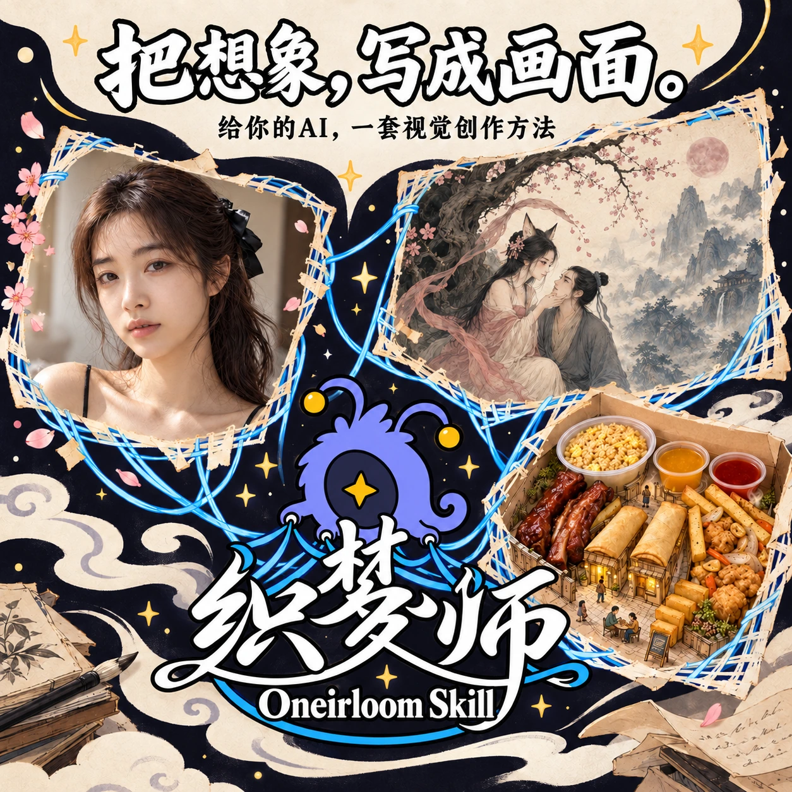
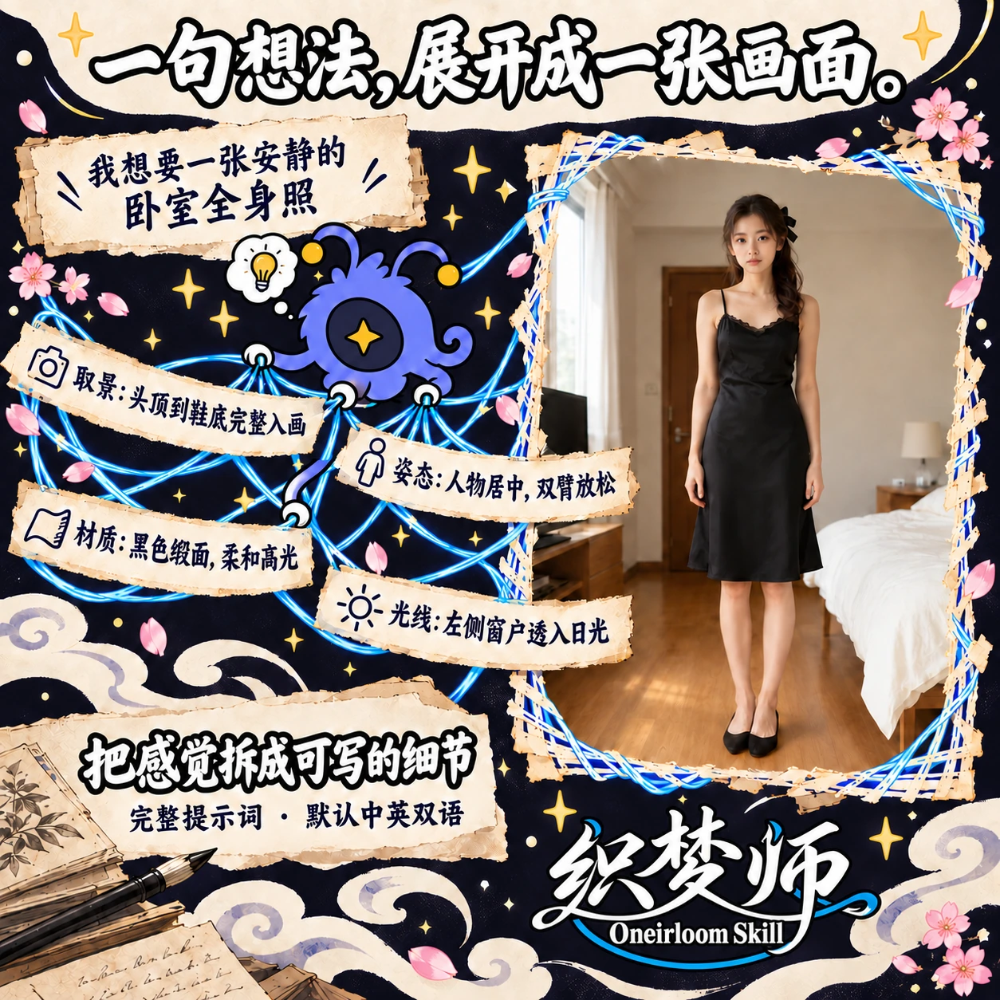
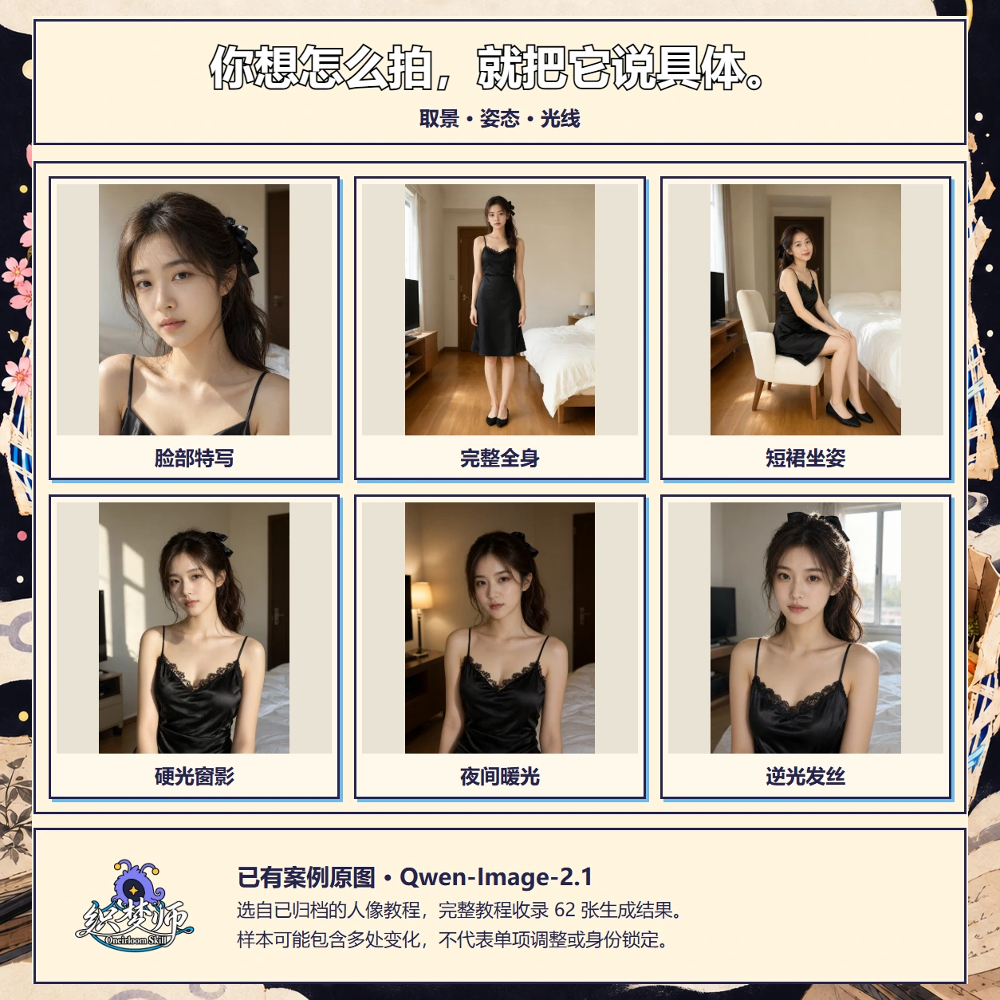
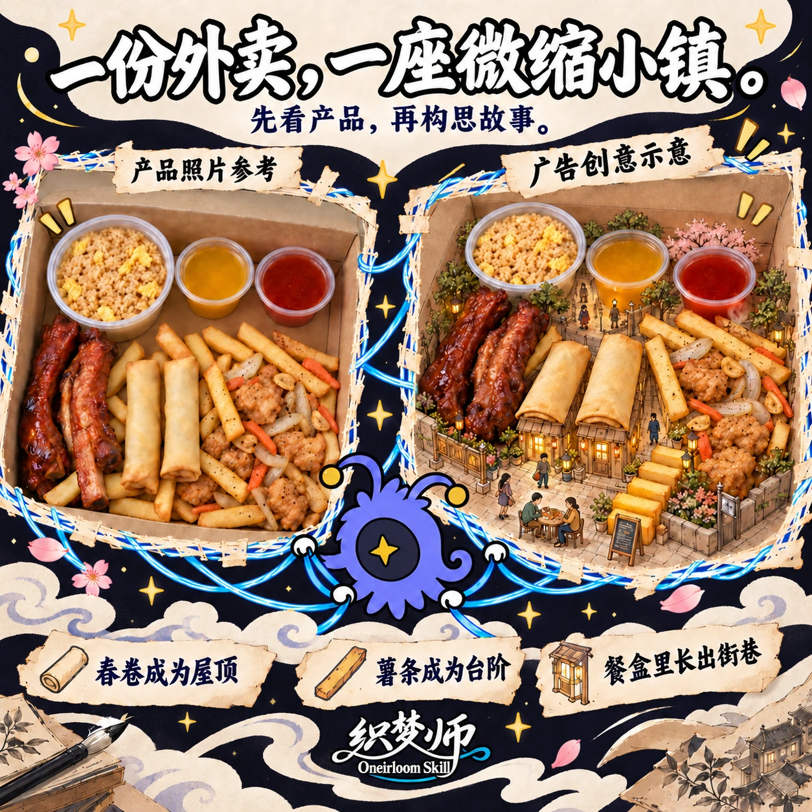
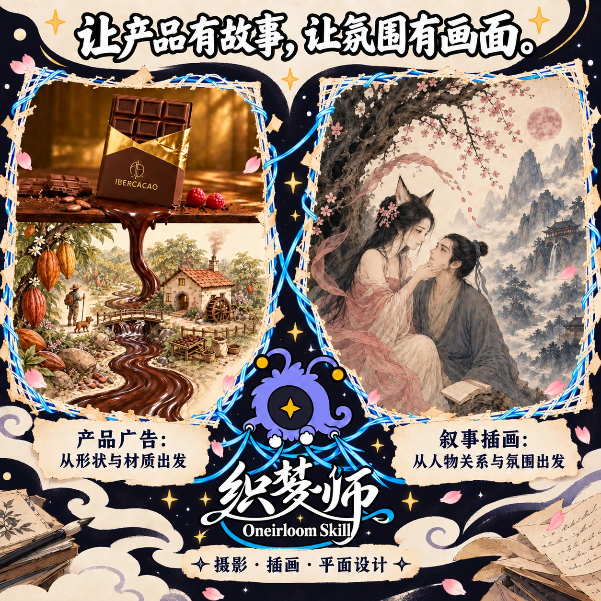
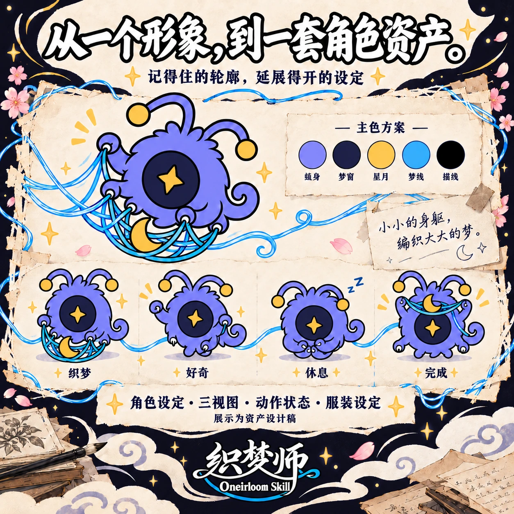
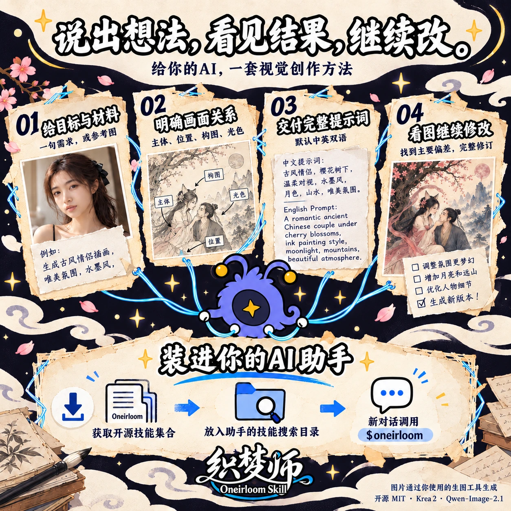
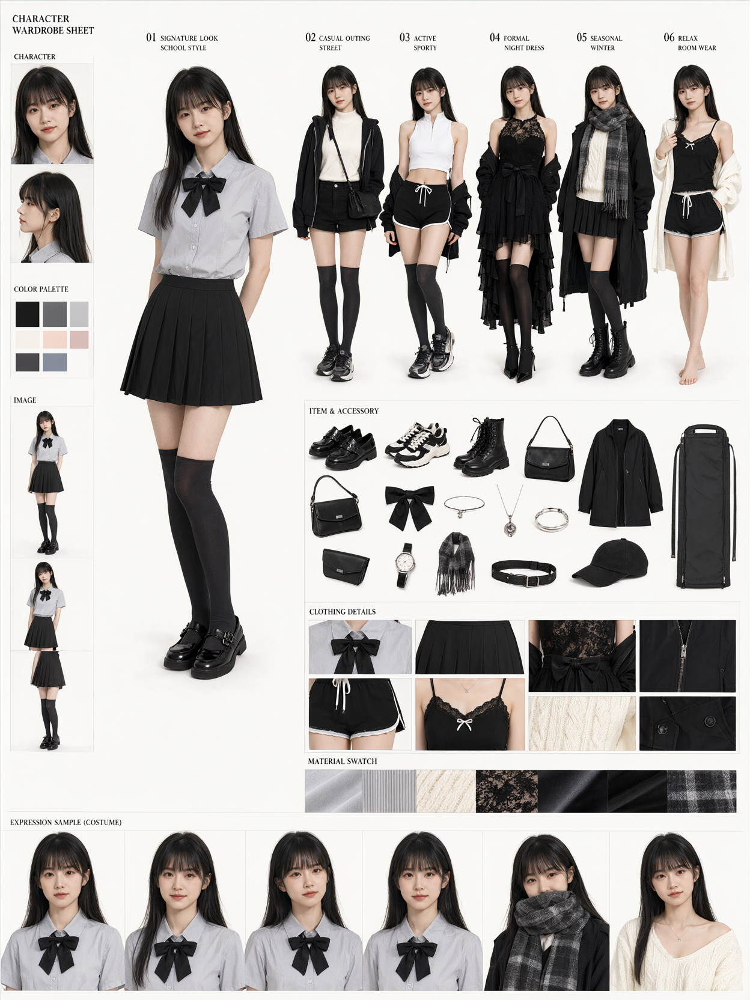

<div align="center">

<h1>织梦师 · Oneirloom</h1>

<p><strong>把想象，写成画面。</strong></p>

<p>一套包含 18 个免费技能的开源视觉创作 Skill。让你的 AI 助手结合参考图和想法，边讨论、边设计、边修改；覆盖产品带货、摄影与插画、角色与表情贴图、图标、品牌视觉、结果诊断和提示词分享卡片。</p>

<p align="center"><a href="https://github.com/PigeonAI-Yang/oneirloom/releases/tag/v0.2.0-preview.1">当前预览版：0.2.0-preview.1</a> · <a href="https://github.com/PigeonAI-Yang/oneirloom/releases/download/v0.2.0-preview.1/oneirloom-0.2.0-preview.1.zip">下载完整安装包（18 个免费技能）</a></p>

<p>
  <a href="https://github.com/PigeonAI-Yang/oneirloom/stargazers"></a>
  <a href="https://github.com/PigeonAI-Yang/oneirloom/forks"></a>
  <a href="https://github.com/PigeonAI-Yang/oneirloom/watchers"></a>
  <a href="LICENSE"></a>
</p>

<p>
  <a href="https://www.pigeonyang.top/skills/oneirloom/"></a>
  <a href="#案例与记录"></a>
  <a href="https://github.com/PigeonAI-Yang/oneirloom/issues"></a>
  <a href="https://github.com/PigeonAI-Yang"></a>
  <a href="https://x.com/KimbomArtist"></a>
  <a href="https://www.xiaohongshu.com/user/profile/689af6b90000000019016082"></a>
</p>

<p>
  <a href="#开始使用">开始使用</a> · <a href="#案例与记录">案例与记录</a> · <a href="#技能目录">技能目录</a> · <a href="README.md">中文</a> | <a href="README.en.md">English</a> · <a href="docs/product-page/index-oneirloom-v4.html">完整详情页</a> · <a href="https://www.pigeonyang.top/skills/oneirloom/">网站</a>
</p>
</div>

<p align="center">
  <a href="docs/assets/product-page/01-hero-oneirloom-v4.webp"></a>
</p>


[](docs/assets/product-page/02-value-oneirloom-v4.webp)

[](docs/assets/product-page/03-portraits-native-v4.webp)

[](docs/assets/product-page/04-product-oneirloom-v4.webp)

[](docs/assets/product-page/05-worlds-oneirloom-v4.webp)

[](docs/assets/product-page/06-character-oneirloom-v4.webp)

[](docs/assets/product-page/07-start-oneirloom-v4.webp)

## 这次更新能怎么用

- 需求明确时，按你给出的约束继续构思。需求开放时，先检查参考图和已有材料，只追问必要问题，再给出 2–3 个有理由的方向。
- 设计产品广告时，保留已确认的产品事实，不对未知成分作断言。幻想场景可以改变产品的尺度或周围环境，但不编造产品事实。
- 局部修改时，保留其他已确认要求。提供真实结果图后，依据图中可见偏差写出完整、具体的修订提示词；未提供结果图时，不声称检查过生成结果。

这些是技能提供的工作指导，不代表已验证新对话行为或生成图像质量。新对话行为仍未完成验证；当前 ChatGPT 账户对两次指定模型请求均返回 HTTP 400。详见[当前发布状态](docs/releases/0.2.0-preview.1-publication.md)。

## 案例与记录

这套详情页由织梦师的视觉分析、设计与光色方法指导制作。六张宣传图参考既有案例重新绘制；人像六宫格直接排版归档原图。宣传图中的场景与提示词示意不等同于原始案例记录，原图与已知提示词见下方链接。[打开完整详情长图](docs/assets/product-page/overview-oneirloom-v4.webp)。

- **人像摄影**：[12 张已归档人像的提示词与参数](docs/assets/portraits/manifest.json) · [62 张生成结果的完整教程](docs/美女生图教程.md)。各样本可能同时改变身份、姿态、衣料与环境，不能据此判断精确身份锁定或单项调整的效果。
- **外卖小镇广告**：[原始照片与认可结果记录](skills/oneirloom-product-art-direction/references/takeaway-food-town/evidence.json)。实际提交提示词、模型与参数未记录。
- **巧克力广告**：[原始提示词与案例](skills/oneirloom-style-design/templates/product-origin-world/template.md)；**志怪插画**：[氛围与观察记录](skills/oneirloom-style-illustration/templates/zhiguai-narrative/template.md)。两者的模型与参数均未知。
- **织梦兽资产**：[公开角色展示](docs/assets/product-page/06-character-oneirloom-v4.webp)。正面形象已获认可，新增资产设计稿仍待单独验收。

<details>
<summary>继续看角色衣橱设定</summary>



这个用户提供的结果展示服装、配件、材质与版面安排。转身视图和部分服装头像仍有偏差，模型与参数未知。[查看模板与记录](skills/oneirloom-character-sheet/templates/wardrobe-sheet/template.md)。

</details>

## 开始使用

### 安装技能集合

当前提供包含 **18 个免费技能**的 `0.2.0-preview.1` 预览版。请从[固定安装包地址](https://github.com/PigeonAI-Yang/oneirloom/releases/download/v0.2.0-preview.1/oneirloom-0.2.0-preview.1.zip)下载发布者提供的 ZIP，并使用[同页校验文件 SHA256SUMS.txt](https://github.com/PigeonAI-Yang/oneirloom/releases/download/v0.2.0-preview.1/SHA256SUMS.txt)核对；不要把 GitHub 自动生成的源码 ZIP 当作已检查安装包。

按[安装与升级回退说明](docs/INSTALL.md)，将包内 `skills/` 的 18 个目录完整复制到新项目的 `.agents/skills/`，保持同级关系。公开包默认不含私有品牌水印，提示词卡可直接制作无水印版本。已有安装先保留准确备份与包哈希。请以[当前发布状态](docs/releases/0.2.0-preview.1-publication.md)为准；[0.2.0 发布前候选验证记录](docs/COMPATIBILITY.md)保留的是发布前准备阶段的待验状态。

`main` 供开发使用，会继续变化。参与开发时可克隆仓库并通过 Git LFS 获取完整图片；日常安装使用确认过的固定版本包。核心技能无需 Go 或本地生图模型，生图服务和可选卡片渲染依赖另行提供。

在新的对话中检查是否出现 `oneirloom`。你可以称呼它“织梦师”“织梦师Skill”或“Oneirloom”；支持显式调用的助手可用 `$oneirloom`。

### 用一个真实需求开始

以下指令发给 AI 助手。得到提示词后，再将提示词放进生图工具。

```text
用织梦师分析我上传的产品照片，帮我构思一张广告。
保留产品的形状、包装和主要配色，加入手绘微缩世界。
先根据产品本身选择创意，再给我完整提示词，只要中文。
```

```text
用织梦师检查我上传的结果图和原提示词。
现在鞋子被裁掉了，我想要完整全身取景。
保留人物、衣服、房间和光线，给我完整修订提示词。
```

有参考图时，说明每张图负责身份、姿势、配色还是风格。已有目标模型、工具入口、原提示词或结果图时，也一起提供。

## 技能目录

主技能负责理解任务与整合交付，方法技能负责各自的判断。具体画面配方放在所属方法的模板目录中。

<details>
<summary>展开全部技能</summary>

| 技能 | 用途 |
| --- | --- |
| [oneirloom](skills/oneirloom/SKILL.md) | 主入口、上下文继承与完整交付 |
| [oneirloom-visual-analysis](skills/oneirloom-visual-analysis/SKILL.md) | 参考图拆解与视觉关系分析 |
| [oneirloom-product-art-direction](skills/oneirloom-product-art-direction/SKILL.md) | 产品广告概念与画面故事 |
| [oneirloom-camera-composition](skills/oneirloom-camera-composition/SKILL.md) | 景别、机位、透视、裁切与遮挡 |
| [oneirloom-color-light](skills/oneirloom-color-light/SKILL.md) | 区域配色、光向与材质受光 |
| [oneirloom-character-sheet](skills/oneirloom-character-sheet/SKILL.md) | 角色设定、三视图、表情与服装 |
| [oneirloom-expression-stickers](skills/oneirloom-expression-stickers/SKILL.md) | Reaction intent, consistent character identity, and individual sticker delivery |
| [oneirloom-icon-design](skills/oneirloom-icon-design/SKILL.md) | UI icon families, app symbols, and native vector assets |
| [oneirloom-brand-identity](skills/oneirloom-brand-identity/SKILL.md) | Coherent VI foundations, applications, guidelines, and asset handoff |
| [oneirloom-figure-art](skills/oneirloom-figure-art/SKILL.md) | 成人非露骨人物艺术的姿态与遮挡 |
| [oneirloom-style-photography](skills/oneirloom-style-photography/SKILL.md) | 写实摄影、生活人像与电影感画面 |
| [oneirloom-style-illustration](skills/oneirloom-style-illustration/SKILL.md) | 绘画、版画、拼贴与叙事插画 |
| [oneirloom-style-design](skills/oneirloom-style-design/SKILL.md) | 海报、文字版式、包装、产品与 3D |
| [oneirloom-model-krea-2](skills/oneirloom-model-krea-2/SKILL.md) | Krea 2 提示词与入口适配 |
| [oneirloom-model-qwen-image-2-1](skills/oneirloom-model-qwen-image-2-1/SKILL.md) | Qwen-Image-2.1 提示词与任务适配 |
| [oneirloom-result-diagnosis](skills/oneirloom-result-diagnosis/SKILL.md) | 生成偏差分析与提示词修正 |
| [oneirloom-image-tutorial](skills/oneirloom-image-tutorial/SKILL.md) | 图文教程写作、扩写与润色 |
| [oneirloom-prompt-card](skills/oneirloom-prompt-card/SKILL.md) | 作品与完整提示词的 3:4 分享卡片 |

</details>

## 专项设计方法

| 方法 | 用途 | 模板 |
| --- | --- | --- |
| [oneirloom-expression-stickers](skills/oneirloom-expression-stickers/SKILL.md) | 贴图反应设计、角色一致性与单张贴图交付 | [头部反应、动作手势、文字反应](skills/oneirloom-expression-stickers/templates/index.md) |
| [oneirloom-icon-design](skills/oneirloom-icon-design/SKILL.md) | UI 图标系列、应用符号与原生矢量资源 | [线框 UI、实心 UI、应用符号](skills/oneirloom-icon-design/templates/index.md) |
| [oneirloom-brand-identity](skills/oneirloom-brand-identity/SKILL.md) | 统一的 VI 基础、应用延展、规范与资源交接 | [字标、角色、编辑视觉体系](skills/oneirloom-brand-identity/templates/index.md) |

[三层架构](docs/architecture.md) · [模型证据](docs/model-evidence.md) · [摄影模板](skills/oneirloom-style-photography/templates/index.md) · [角色模板](skills/oneirloom-character-sheet/templates/index.md) · [插画模板](skills/oneirloom-style-illustration/templates/index.md) · [设计模板](skills/oneirloom-style-design/templates/index.md)

[表情贴图模板](skills/oneirloom-expression-stickers/templates/index.md) · [图标模板](skills/oneirloom-icon-design/templates/index.md) · [品牌视觉模板](skills/oneirloom-brand-identity/templates/index.md)

这三种方法包含九个经过调研的基础起始模板，不代表全部模板。表情贴图方法另提供 14 个扩展模板，离线浏览器检查已通过。新角色/VI 生图和完整 VI 制作仍未验收。请求 SVG、资产套件或 VI 指南时，按成果约定交付；只需提示词时，仍提供完整中英双语提示词。联系表或品牌板本身不代表完整资产交付。

## 常见问题

**需要额外安装生图模型吗？**

织梦师安装的是提示词与创作方法。图片生成通过你所用助手的工具或生图入口运行，是否需要本地模型由该工具决定。

**模板里的例图都能复现吗？**

案例记录会说明已有结果、已知参数和偏差。部分模板尚未生成验证；实际效果需要在你的入口中生成并检查。

**可以只要中文吗？**

可以。默认是中英文完整提示词，你也可以指定一种语言。教程采用你要求的文章语言和文风。

## 一起把好用的方法留下来

欢迎补充画面配方、修正方法，或提交带原图与提示词的案例。[贡献指南](CONTRIBUTING.md)说明了模板和记录的组织方式。

如果织梦师帮你写清了想画的图，欢迎给项目一颗 Star，或在 [Issues](https://github.com/PigeonAI-Yang/oneirloom/issues) 分享需求与结果。

## 许可证

[MIT License](LICENSE)。模型与生成服务的使用条款另行适用。
