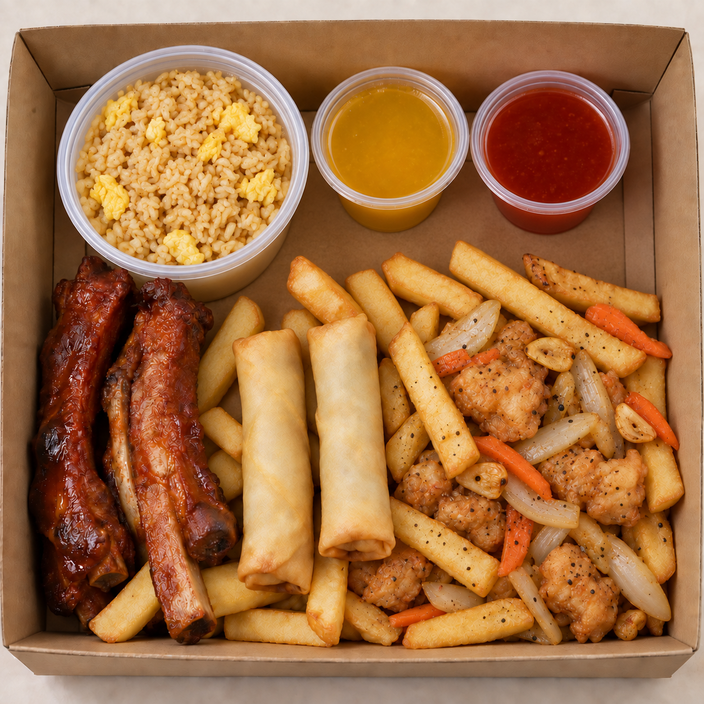
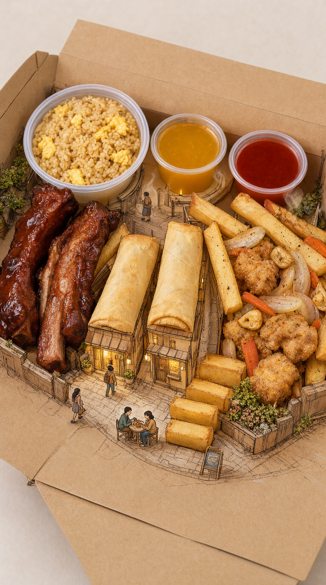

# Takeaway meal as a miniature food town

**Evidence status:** The user accepted this supplied final image for this source on 2026-09-28: “这是最终效果。我认为可以。” This records one accepted pairing, not repeatability.

## Source image

The square product photo shows an open kraft box containing rice with yellow egg pieces, clear cups of yellow and red sauce, glazed bone-in meat, two long spring rolls, thick fries, and battered pieces mixed with onion and carrot. These visible food categories and the carton identify the source. Their positions, camera crop, and staging can be redesigned.

## Product-led concept

The concept was chosen after inspecting the source. The spring rolls' long, crisp forms can read as shop roofs; the fries' block shapes can build a stepped path; and the open box gives hand-drawn architecture a paper ground plane continuous with the food. Together they support a small food town inside the meal's existing materials and forms.

## Accepted result

In the accepted portrait image, the two spring rolls sit across the foreground as roofs of finely drawn shops. Fries descend at the right as steps into a hand-drawn street. Tiny diners, storefronts, and planted edges share the same scene on the opened kraft carton. The rice, both sauce cups, glazed meat, and battered pieces remain visible as realistic food. The town grows around the food and box instead of appearing as a separate scene joined by a sauce waterfall.

This result keeps the main food types recognizable. It does not establish exact item-count fidelity, model or setting repeatability, or transfer to other meals. Miniature architecture is specific to this source's long rolls, block-shaped fries, open carton, and the chosen direction; it is not a default food treatment.

The [preceding assistant-proposed Chinese prompt](prompt.zh.txt) is preserved from this conversation. The user supplied and accepted the result after that proposal; the exact submitted language, any edits, model, and generation settings remain unknown. The proposal requested 3:4, while the accepted image is 768 x 1376 pixels, so acceptance does not establish aspect-ratio compliance.
