# 教会AI画出想要的美女，让AI读完这篇就够了

这篇教程，我会带你从一张卧室写真开始，试着改变取景、姿势、衣服和光线，最后做出一组四宫格。

每次生成图片，我都会先看它有没有表现出我想要的内容。展示穿搭，就得看清衣服的剪裁；表现居家气氛，就得让人看出她身处什么样的房间；做四宫格，还要比较四张脸、四套衣服和各自的动作。

全文分成16章。每章我都会结合图片，说明有哪些拍法、适合什么情况、提示词该怎么写，以及图片不合要求时可以从哪里改起。服装会细讲版型、裙长、正面与背面的设计、内外搭配，还有坐下以后布料的变化。姿势、场景和光线也会分别展开。

这里的配图都是我用本地 Qwen-Image-2.1 工作流实际生成的。哪些地方做到了，哪些地方还不够准确，我会对着图片说明。你会看到成功的例子，也会看到特写变成全身、左右手弄反、房间里多出地毯这样的情况。

文中的短提示词可以用来替换完整提示词里的相应部分。第13章和第15章放了完整例子，素材包里也保留了每次生成图片时使用的全文。练习时，可以先沿用相同的人物、房间和光线描述，再修改当前要练的内容。

## 01｜动手之前，我先想清楚这张照片要拍什么

### 照片的用途决定我先写什么

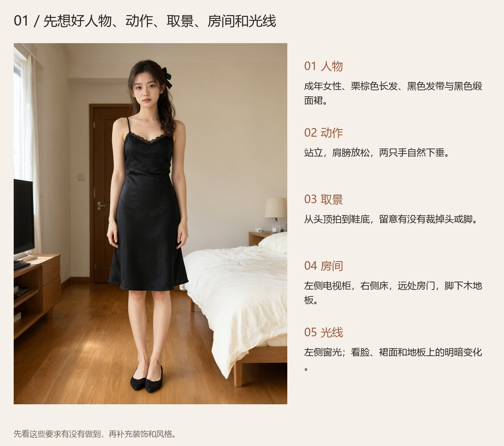

我先定下贯穿这篇教程的人物形象：一位25岁的成年女性，栗棕色微卷长发，戴黑色蝴蝶结，穿黑色缎面裙。她所在的房间有木地板、床、电视柜和一扇深棕色门，日光从左侧照进来。有了这些相同的描述，后面就可以着重比较每次改动的地方。

接着，我会想这张照片准备用来做什么。做头像，要先看脸和眼神；展示穿搭，要看清衣服轮廓和全身；想表现居家生活，就得给家具和房间留些位置。用途想清楚了，哪些细节该多写、哪些可以省略，也就有了依据。

比如展示长裙，我需要让读者看清裙摆到哪里、有没有盖住鞋。如果同时要求脸部占满画面，就很难兼顾。我会把全身穿搭和领口近照分开生成，每张图各有侧重。

写提示词之前，我还会记下哪些必须保留，哪些准备修改，哪些可以让模型自行安排。人物长相、衣服款式或房间布局通常需要说清楚；不影响这张照片的小装饰，可以少写。图片出来后，我就知道该重点检查什么。

```text
这张照片用于展示整套穿搭。人物从头顶到鞋底完整入画，看得清裙摆的长度和鞋子。背景保留卧室里的床、电视柜和木地板，人物占画面的主要部分。
```

### 我怎样把参考图写成具体要求

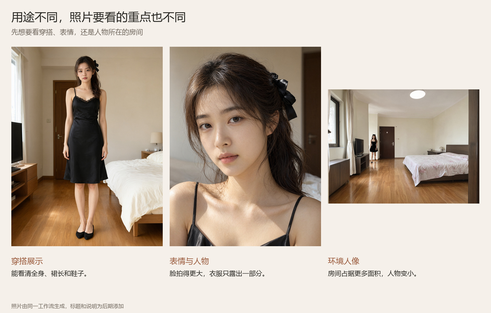

拿到参考图，我会先看画面里有什么。头顶和脚有没有被裁掉？裙摆到哪里？哪只手被挡住了？人物是在床前，还是站在床边？看不清的地方先不猜，尤其不能把自己想象的服装细节写成图里已经有的东西。

接下来，我会把笼统的形容词写得具体一些。想说人物“轻松”，可以描述她肩膀放松、双手搭在扶手上、后背靠着椅子；想说画面“有空间感”，就写近处的门框、中间的人物和远处的床。这样读者和模型才知道，我说的感觉究竟来自哪里。

参考图也可以只保留一部分。想换衣服，就说明换哪件、换成什么样；想保留房间，就把床、电视柜和门的位置写下来。已经决定改掉的地方，生成后就按新要求检查，不再拿原图逐项比较。

```text
请看这张参考图，分别描述人物长相、衣服款式、身体和头的朝向、手脚放在哪里、照片拍到了身体的哪个部位，以及家具位置和光线方向。把图中已有的内容与我想修改的地方分开写，看不清的地方不要猜。再根据这张照片的用途，整理成一段完整提示词。
```

我会先读一遍 AI 的描述，再让它整理提示词。要特别留意它有没有把“转头”说成“转身”，把“相机位置低”说成“人物弯腰”，或把内外两件衣服看成一件。这些地方认错了，后面写得再细，也很难生成想要的画面。

## 02｜景别：这张照片要拍到身体的哪个部位

### 我会写清楚照片从哪里拍到哪里

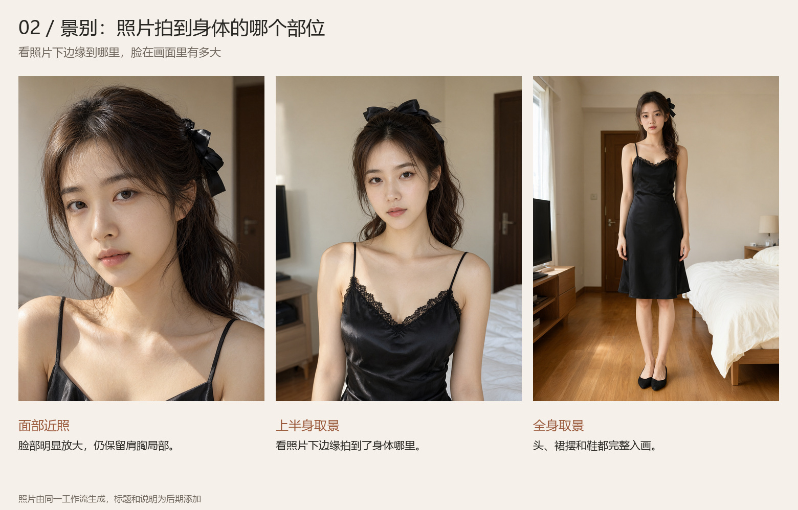

摄影里说的“景别”，可以先理解为照片拍到了人物的多少。想看眼神，就把脸拍大一些；想看领口、肩带和手部动作，就留出上半身；想看裙长、鞋子和站姿，就拍全身。

我写“近景”或“半身照”时，还会补一句具体拍到哪里。比如头顶上方留一点空隙，照片下边缘到腰部；或是从头到鞋都拍进去，脚下再留一小段地板。最好再写明人物大约占多大面积，免得虽然拍到了全身，人却缩在远处。

取景范围要跟着展示的内容走。看袖口，需要露出手腕；看两膝交叠，需要拍到膝盖以下；看脚跟抬起，就得把鞋和地面一起拍进去。我会先想读者需要看清哪里，再决定照片该拍多近。

```text
上半身近照，头顶上方留少量空隙，照片下边缘到腰部。脸、肩膀和领口占主要面积。双手在胸口下方拿着杯子，杯子和两只手都完整入画。
```

这里写了手和杯子，就必须给它们留位置。如果把照片下边缘改到锁骨附近，胸前持杯的动作就拍不进去了。改景别时，我会顺便检查动作，删掉新画面里无法展示的要求。

### 横竖比例、人物大小和裁切位置要分开考虑

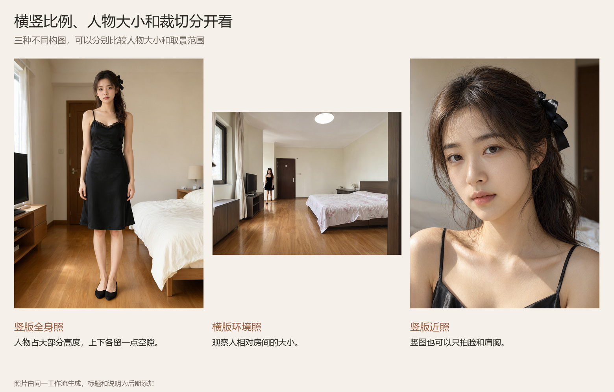

横图还是竖图，说的是照片的形状；全身还是近照，说的是里面拍了什么。同样一张竖图，既可以放下完整站姿，也可以只拍脸和肩膀。横图也能拍全身，只是人物两侧通常有更多空间。

我会先根据图片的用途选横版或竖版，再决定人物占多大，最后看头、手和脚有没有被裁掉。想展示整套穿搭，可以让人物占据竖图的大部分高度；想让读者看清房间，可以用横图，并把人物放小一些。

上面的横图同时改变了人物大小和房间的展示范围，可以把它看作另一种构图。如果只想比较横竖比例的影响，就保留提示词和其他参数，只改图片尺寸，再看结果怎样变化。

我也遇到过明明写了“面部特写”，结果还是全身照。回头看提示词，后面还要求鞋子、双手和整间卧室都出现。我删掉这些内容后，脸才明显放大。不过生成的近照仍然多露出了一些肩胸，没有精确停在我原先要求的锁骨位置。

如果反复修改还是拍得不够近，我会看看所用工具能否上传参考图或修改已有图片。也可以后期裁切，但要分清楚：裁过之后画面合适了，并不意味着模型最初就生成了准确的取景。

## 03｜机位：相机放在哪里，照片就会怎样变化

### 我会结合背景判断俯拍和仰拍

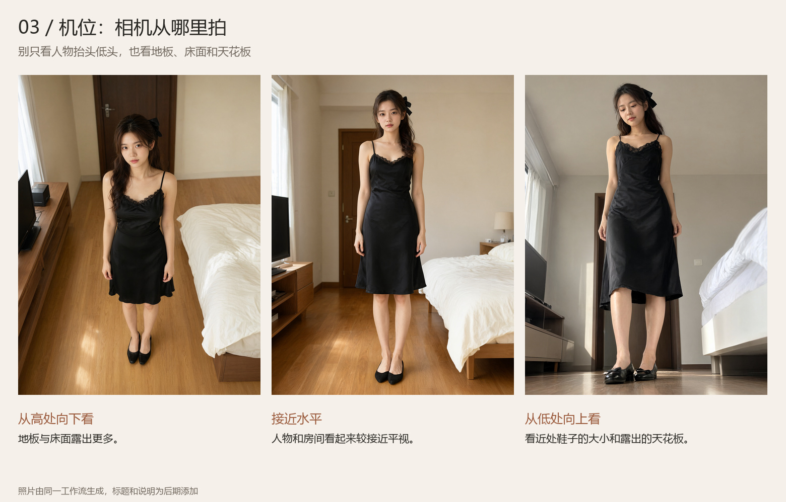

“机位”就是相机的位置。相机放得高还是低、离人多远、从哪一侧拍，都会影响照片。我会先选一项来比较。上面这组主要看高低变化，所以都保留全身，让地板、床面和天花板帮助我们判断拍摄角度。

从高处往下拍，通常更容易看到头顶、肩膀上方和床面。靠近地面向上拍，则容易看到床的侧面、门框上部和天花板。因此，判断俯拍或仰拍时，要把人物和房间一起看。

距离也会影响身体比例。相机很低，又离鞋很近，鞋和小腿看起来可能更大；从高处靠近头部拍，头和肩膀可能更突出。比例不合适时，我会连同拍摄距离一起调整，光强调“再低一点”未必有用。

```text
相机放在接近人物脚踝的高度，镜头向上拍。人物从鞋到头完整入画，靠近镜头的鞋和腿显得更大。背景能看到床的侧沿、门框上部和一部分天花板。
```

这段有意强调了低处向上看的效果。拍普通穿搭照时，我通常先用接近水平的角度，让衣服的轮廓和长度容易辨认，再尝试更明显的俯拍或仰拍。

### 人物低头和相机俯拍是两回事

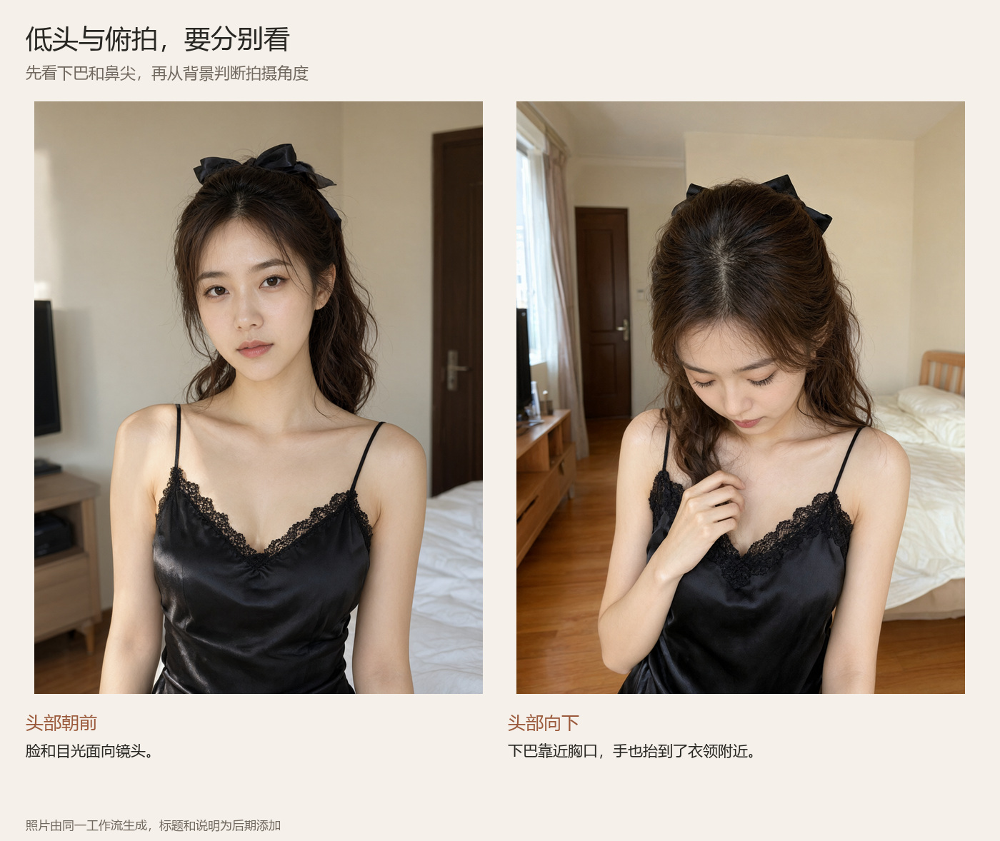

看人物露出了头顶，不能马上判断这是俯拍。也可能相机没有动，只是她低下了头。我会分别看头颈姿势和背景里的拍摄角度，避免把两种变化混在一起。

右图中，我要求相机保持在人物原先的眼睛高度，让她低头看衣领。下巴靠近胸口，鼻尖和目光朝下，这些都是低头的线索。门框和床面则帮助判断相机有没有跟着改变位置。

```text
相机保持在人物原先的眼睛高度，镜头水平向前。人物双肩放平，头微微低下，下巴靠近胸口，目光看向衣领。照片仍拍到腰部以上。
```

两张图是分别生成的，不能把背景的细小差异当作相机绝对没动的证明。右图还多了抬手靠近衣领的动作。需要严格保持原来的角度时，我会检查工具是否支持参考图或图片编辑，再选择合适的做法。

## 04｜朝向：身体、头和眼睛分别朝哪里

### 我先决定要展示人物的哪一面

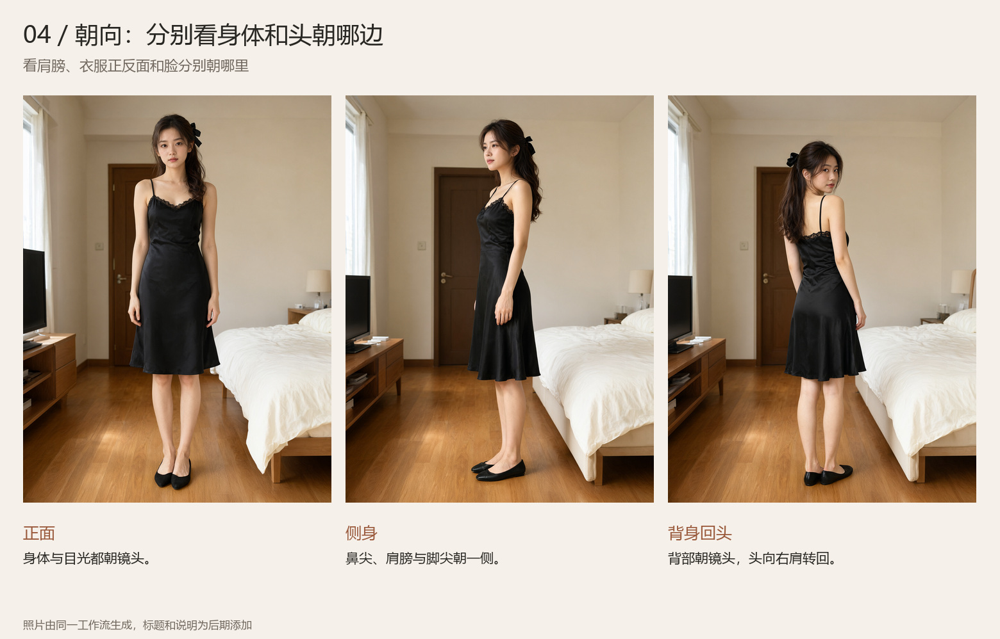

正面容易看清脸和前领口；侧身适合看侧缝、腰部轮廓和手臂的位置；背面可以展示发型与后背设计。我会先想这张图要看哪里，再决定人物怎样转身。

“侧身”也要说得具体一点。只是稍微转开，胸前仍会露出很多；完全侧对镜头，则主要看到身体一侧；再转过去，背部就会更明显。提示词里可以直接写这些区别，需要时再加角度。图中还看得到较多正面，就把它叫作斜侧身，别写成完全侧面。

展示后背时，要先让肩膀和身体转过去，再安排头部。想露出侧脸，可以让她回头；如果整个人都转回镜头，后背的设计就看不清了。

```text
人物背对镜头，照片主要展示衣服后背。头从右肩上方转回，露出侧脸。后背、后腰和裙摆都清楚可见。
```

长发也要考虑进去。头发铺满后背时，系带或开口很容易被挡住。我会写明把头发拨到哪边，让需要展示的地方露出来。

### 我把转身、转头和视线分别写清楚

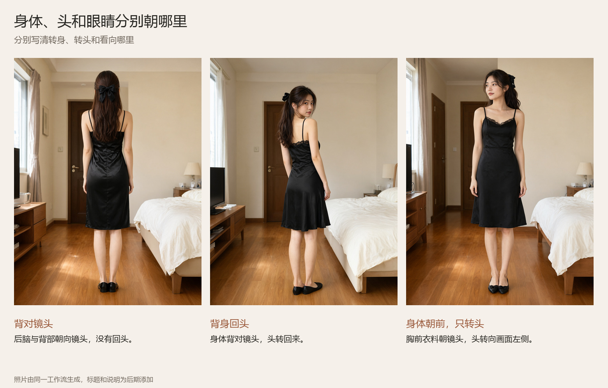

我通常先写身体，再写头，最后写眼睛。例如“身体背对镜头，头从右肩上方转回，眼睛看向镜头”；或是“身体正对镜头，头转向画面左侧，目光看向左边画外”。按这个顺序写，不容易漏掉。

如果只想改变眼神，就保留头部朝向，单独写眼睛看哪里。想让她完全背对镜头，就删掉“直视镜头”这样的要求，否则很容易又生成回头的姿势。

```text
人物身体正对镜头，两肩基本放平，脚尖朝前。只有头转向画面左侧，鼻尖和目光都朝向左边画外。
```

左右要说明是从谁的角度看。“画面左侧”是我们看照片时的左边，“人物左侧”是她自己的左边。她转过身后，两者的对应关系也会变。指定某只手、某条腿时，我会写人物自身的左右；指定画面位置时，就写“画面左侧”或“画面右侧”。

检查图片时，我会从脚尖往上看，再看肩膀、鼻尖和眼睛。它们可以朝不同方向，但要和提示词里安排的姿势相符。

## 05｜构图：人物放在哪里，房间留出多少

### 位置和大小，我会一起说明

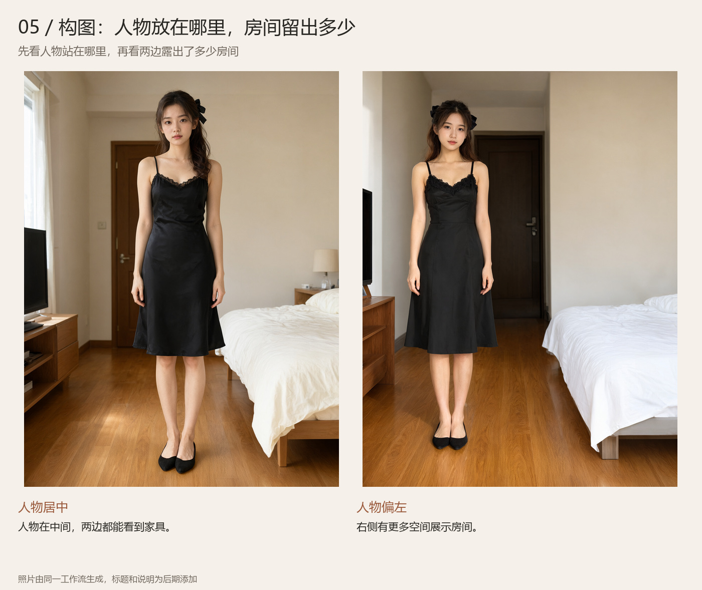

让人物往左站，和把人物放小，是两件不同的事。如果我想多露出右侧房间，就会写清人物在画面中的位置，同时说明她大约占多高。

居中便于看完整轮廓，也适合比较衣服。偏左或偏右，则能在另一侧留出床、窗户或桌子。如果要留一块空白，我会先想它有什么用：准备放标题，还是让人物望向那边。这样才不会只剩一大片空墙，人却被挤在角落里。

```text
人物站在画面偏左处，身体中心大约位于画面宽度四分之一的位置。头顶到鞋底完整入画，人物约占画面高度的八成。右半边留出床铺和墙面，脚下木地板一直延伸到远处。
```

这组图最初只顾着把人移到左边，结果脚下多出了一块地毯。我重新强调房间里铺的是连续木地板，才得到现在的图片。改好人物位置以后，原本想保留的房间细节也要再看一遍。

### 想多展示房间，可以把人放小，或从门口拍进去

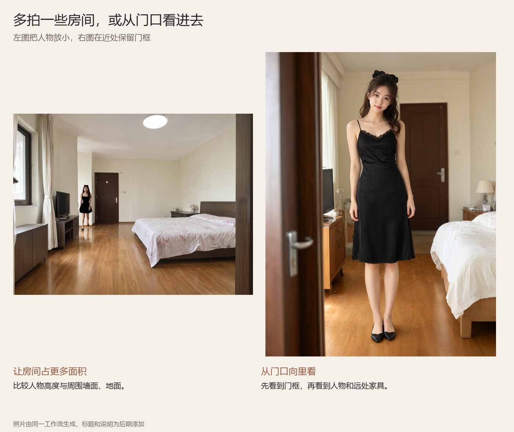

想让读者看清她住在什么样的房间，可以把人物放小一些，多拍墙面、床铺和地板。此时就不适合再要求脸占满照片。人物和房间各占多少，要围绕这张图想展示的内容来安排。

也可以像右图这样，在近处保留一段门框。我们先看到门框，再看到房间里的人，视线最后落到床和远处的门上，会有从门口向里看的感觉。不过门框会挡住一部分画面，需要写清楚它放在哪边、占多宽。

```text
从卧室门口向里拍，近处门框位于画面左边，约占画面宽度的六分之一。人物站在门框后面的过道中，头部和身体没有被门框挡住。床铺和后墙位于更远处。
```

我会留意一些容易看着别扭的地方：门框有没有挡脸，椅背和手臂是否重叠得难以分清，床沿是否刚好横在膝盖附近。遇到这种情况，可以换一下人物站位，让人和家具错开一些。

## 06｜姿势：先让人物站得稳、坐得自然

### 我从脚和座椅的位置写起

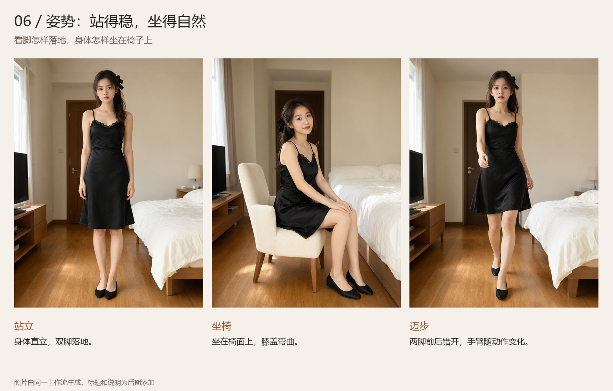

写姿势时，我会先说身体靠什么支撑。站着，双脚怎样落地；坐着，臀部坐在椅子的哪里；走路，哪只脚在前，哪只脚在后。写清这些，再补手臂和表情，动作比较容易连贯。

“正在走路”包含很多瞬间，一张照片只能留下其中一个。我会挑明这一刻的姿势，例如前脚已经落地、后脚脚跟抬起，手臂随着步子摆动。头发飘起来可以增添动感，但腿和脚仍然要有迈步的样子。

```text
右脚向前迈出并落地，左脚留在后方，左脚脚跟抬起。左臂轻轻向前摆，右臂向后摆，裙摆随步子略微摆动，脸和目光朝向镜头。
```

图片出来后，我会先看鞋底与地面。如果两脚一前一后，却像悬在空中，或者腿和脚的位置接不上，就先改这些地方。手臂、头发和裙摆的动作，也要和步子相配。

### 坐在椅子前沿和靠着椅背，写法不同

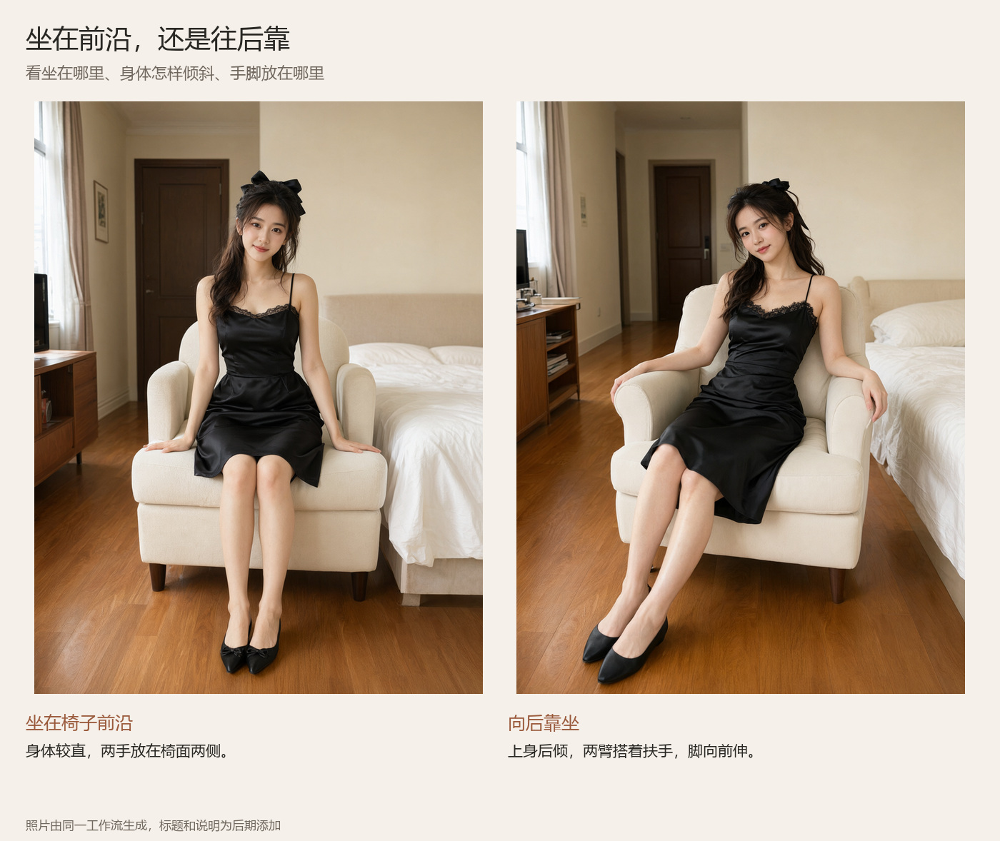

坐姿可以从坐的位置开始变化。坐在前沿，臀部靠前，后背离开椅背，双脚落地；往里坐一些，后背便可以靠住椅背，手臂搭在扶手上，脚也能向前伸。两张图的放松程度和身体倾斜都会不同。

我会分别说清楚椅面、椅背和扶手。想让人双手撑着座位，就写手掌放在椅面两侧；想让她向后靠，就写后背贴住椅背。不要一边要求往后靠，一边又让上身明显前倾。

```text
人物坐在扶手椅里，后背贴着椅背，上身略向后倾。两只前臂分别搭在扶手上，双脚向前伸一些，脚底落地，肩膀放松。
```

坐下来以后，衣服也会变。长裙会铺在腿上，并在膝弯附近折叠；短裙下摆则可能上移。原来的款式描述可以继续用，但裙摆怎样垂下，要按坐姿重新说明。

### 想让站姿有变化，我会先安排两条腿

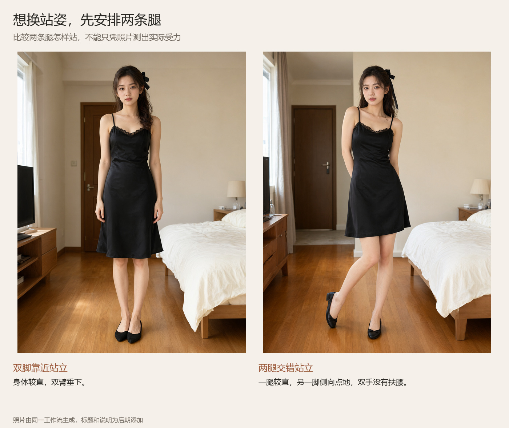

我通常先决定主要用哪条腿站稳，再安排另一只脚。另一条腿可以稍弯，脚尖点地，或者向前、向侧面伸一点。肩膀和胯部也可以随之略微倾斜，没必要一开始就规定很多细小角度。

```text
人物主要用右腿支撑身体，右腿站稳。左膝放松，左脚向侧面伸出并点地，脚跟略微抬起。一只手扶腰，另一只手自然垂下，两肩略有高低。
```

看静态图片，只能判断她看起来是否站得自然，无法测出身体真正的受力。上面的右图能看出一条腿较直，另一只脚向侧面点地，但双手没有按要求扶腰，而是收到了身后，左右腿也没有准确对应。

因此，这张适合用来比较站姿的变化。如果我这次必须做到“右腿支撑、单手扶腰”，还要继续修改。改姿势时最好先保持原来的拍摄角度，否则镜头一变，腿看起来也会变长或变短，不容易判断动作究竟改得怎样。

## 07｜眼神和表情：让人物的神态更明确

### 脸朝哪里和眼睛看哪里，要分开写

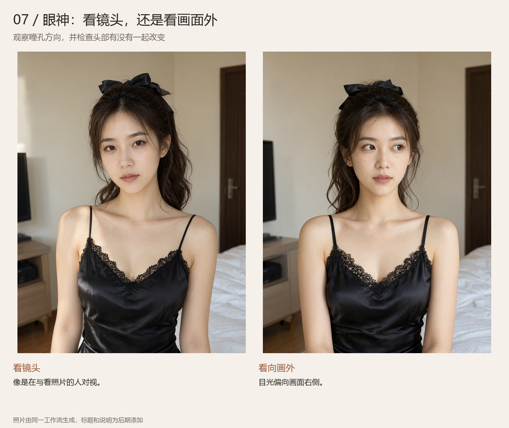

看镜头，像是在和看照片的人对视；看向画外，则会让人猜想她正在注意什么。我会给视线一个具体方向，比如窗边、手里的杯子或衣领，这比只写“眼神有故事”更清楚。

如果身体和头都不想变，就保留它们的朝向，单独改眼睛看哪里。这次右图的头也略微转动了，所以它展示的是看向画外的效果，不能当作“只动眼睛、头完全没动”的例子。

```text
头部保持朝向正前方，眼睛看向画面右侧的窗边。嘴唇轻轻闭合，肩膀放松，照片拍到腰部以上。
```

视线的变化很小，我会放大图片看双眼，不只看鼻尖朝哪边。两只眼睛应该像是在看同一个地方，如果一只看镜头、另一只明显偏开，就需要再改。

### 表情写到眼睛、脸颊和嘴，才更具体

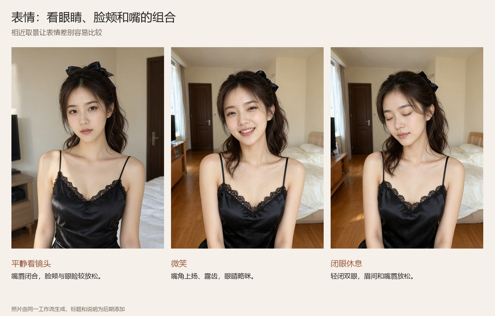

同样是开心，有人只微微扬起嘴角，有人会露齿笑。想表现放松，也可以看镜头，或是轻轻闭眼。我会先决定神态的轻重，再写眼睛、眉间和嘴的变化。

比如我想要轻松的微笑，就写嘴角上扬、脸颊略抬、露出少量牙齿。闭眼休息则要加上眉间舒展、嘴唇放松，免得看起来像在用力闭眼。

```text
双眼略微眯起，脸颊轻轻抬起，嘴角上扬，露出少量上排牙齿。人物面向镜头，肩膀放松，自然地微笑。
```

笑起来时，眼睛和脸颊的形状本来就会变，不必一有变化就认为换了人。但鼻形、眉眼间距、发际线也一起明显改变，就要仔细比较长相。最好用相近的取景和光线来看表情，减少阴影造成的干扰。

## 08｜手部动作：每只手放在哪里、在做什么

### 先写放手的位置，再写动作

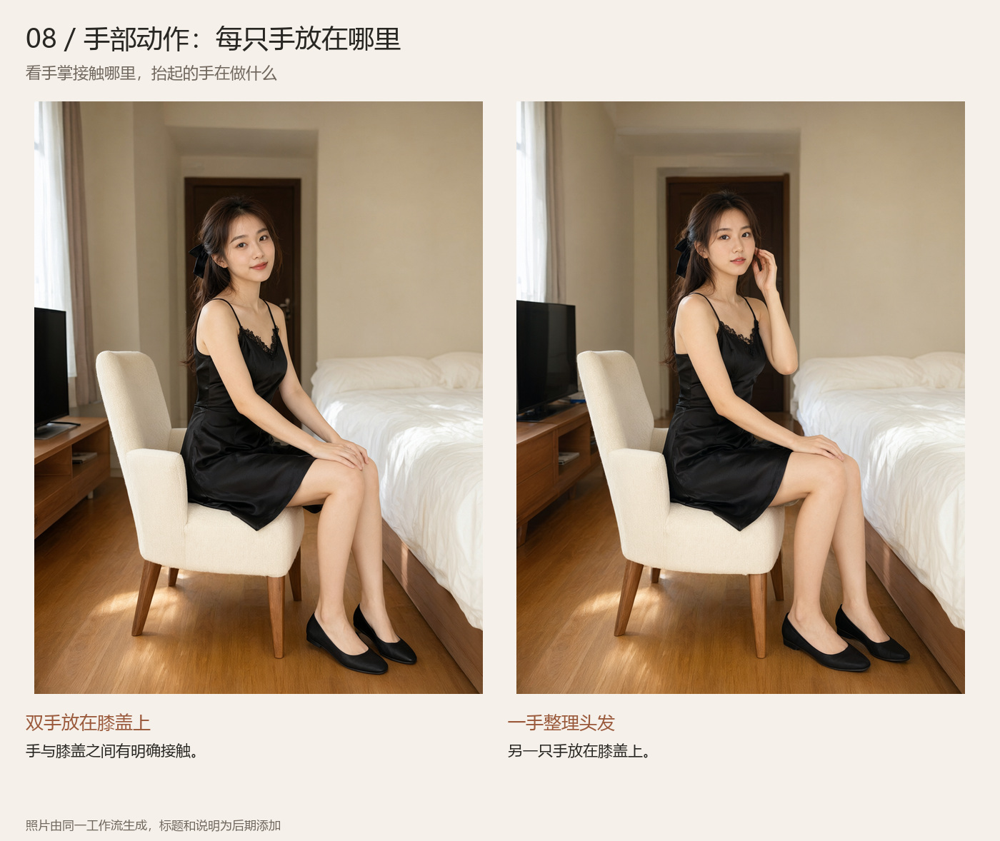

没安排手部动作时，我会让手有处可放。膝盖、扶手或床沿都可以，只要和当前姿势相配。“手自然放着”太笼统，改成“手掌放在膝盖上”，画面就明确多了。

整理头发也有不同动作。手指碰到耳边发丝，和整只手挡住脸，效果差很多。我会说清手抬到哪里、指尖碰到哪里，让读者还能看见想展示的脸部。

```text
一只手平放在膝盖上，手指顺着大腿自然伸展。另一只手抬到耳边，指尖轻碰一缕头发，手腕放松，不遮住脸。
```

右图做出了整理头发和另一只手放在膝上的动作，但人物自身的左右手与原提示词相反。如果只需要这类姿势，它可以作为例子；如果明确要求右手整理头发，就还得改，不能看着顺眼便忽略左右。

### 拿杯子或搭扶手，要说清手怎样接触物体

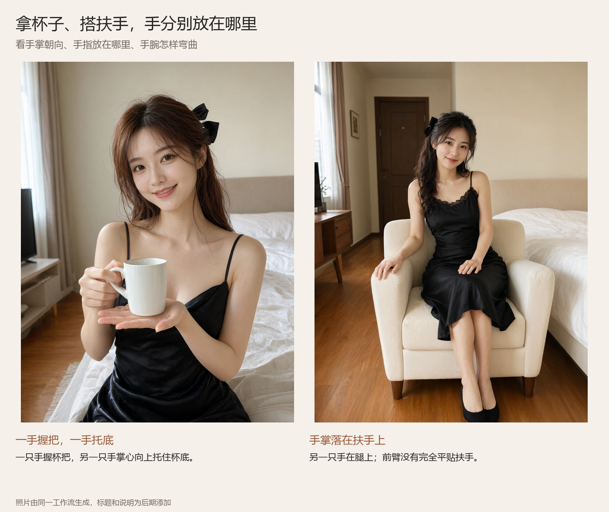

“拿杯子”可以是握杯把、托杯底，也可以双手捧住杯身。不同拿法，手指和手腕的位置都不同。杯子放在胸前还是腰前，也要写清，并给双手留出足够的画面空间。

我会把两只手分开描述。例如杯子直立，一手握把、一手托底；坐在椅上，则可以一手搭扶手、另一手放腿上。这样左右手的位置和动作就都说清楚了。

```text
双手在胸口下方拿着一个白色陶瓷杯。杯子直立，一只手握住杯把，另一只手掌心朝上托住杯底。杯子和两只手都完整入画。
```

第一张持杯图把“托底”画成了扶着杯身。我进一步写明“杯底放在向上摊平的手掌上，这只手在杯子下方，另一只手从侧面握把”，才得到上面的结果。把掌心方向和杯底位置说清楚，比反复强调“捧着”更有帮助。

扶手图也有没做准的地方：手掌搭到了扶手上，前臂却没有沿扶手平放，另一只手也更靠近大腿，而非膝盖。这些差别都要对着实际图片说明。

检查手部时，我会看手指有没有和杯把粘在一起，杯底有没有穿过手掌，手腕是否弯得别扭。被杯子挡住的手指不一定缺失，露出来的部分则要接得合理。如果动作太复杂、反复生成都不自然，可以先简化其中一只手的动作，或使用支持局部修改的图片编辑工具。

## 09｜场景：把房间的位置关系说清楚

### 我先写最能看出房间特点的几样东西

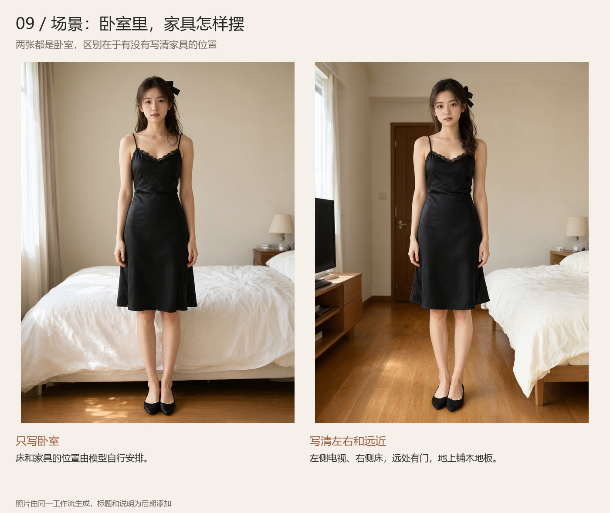

只写“卧室”，模型可以把床放在中间，也可以放在右侧，还可能把窗户安排到人物身后。如果我想保留参考图里的房间，就得多说一句家具放在哪里。

我通常先写最显眼的几样。这次是木地板、右侧床铺、左侧电视柜和远处的门。它们的位置比花瓶里插了几朵花更影响整个房间看起来像不像原图。

```text
蜂蜜棕色木地板从画面下方一直铺到房间远处。床沿画面右侧的墙摆放，左侧是低矮的电视柜。人物站在床与电视柜之间的过道上，过道尽头是一扇深棕色房门。
```

说左右时，我会尽量统一按画面描述，免得和人物自己的左右弄混。写“人物身后”也要小心：如果她背对镜头，她的身后其实是相机这一边，并不一定指远处的背景。

图中提示词较短的那张也生成了卧室，只是家具由模型自行安排。把位置写清楚后，我们才有办法比较床、电视、门和人物是否放在了想要的地方。

### 再说明谁近谁远，哪些地方不能被挡住

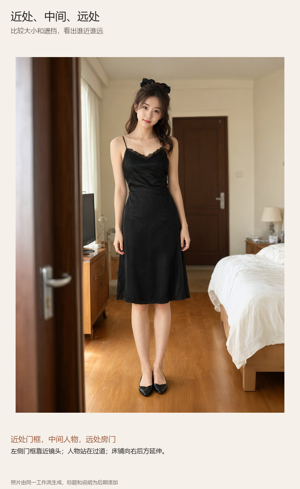

房间里的东西不只是分布在左右两边，还各有远近。门框靠近镜头，人物在房间中间，床向后延伸，房门在最远处。把这些写出来，比只罗列“门框、人物、床、房门”更能说明空间。

遮挡也要看用途。门框挡住一点房间边缘，能让人看出拍摄位置；床挡住小腿，就不方便展示全身动作。想看完整裙摆，就让人物与床沿错开，别让家具把要看的部分遮住。

```text
近处门框位于画面左边缘，人物站在门框后面的过道中。床在人物右后方，头部、双手和裙摆都没有被家具遮挡。深棕色房门位于过道远端。
```

如果换一个角度拍同一间房，我会重新交代相机的位置。镜头换了方向，家具在照片里的左右和大小也可能改变，不能要求它们永远出现在画面的同一个位置。

这次每张图都是根据文字重新生成的，模型并没有先搭好一间房，再在里面换角度拍摄。因此，几张图的家具细节和摆放可能不同。需要更准确地保留同一房间时，可以考虑上传参考图，或使用修改已有图片的方式，具体取决于所用工具支持哪些功能。

## 10｜服装：把一件衣服的样子讲清楚

### 先写版型和长度，再看整件衣服的轮廓

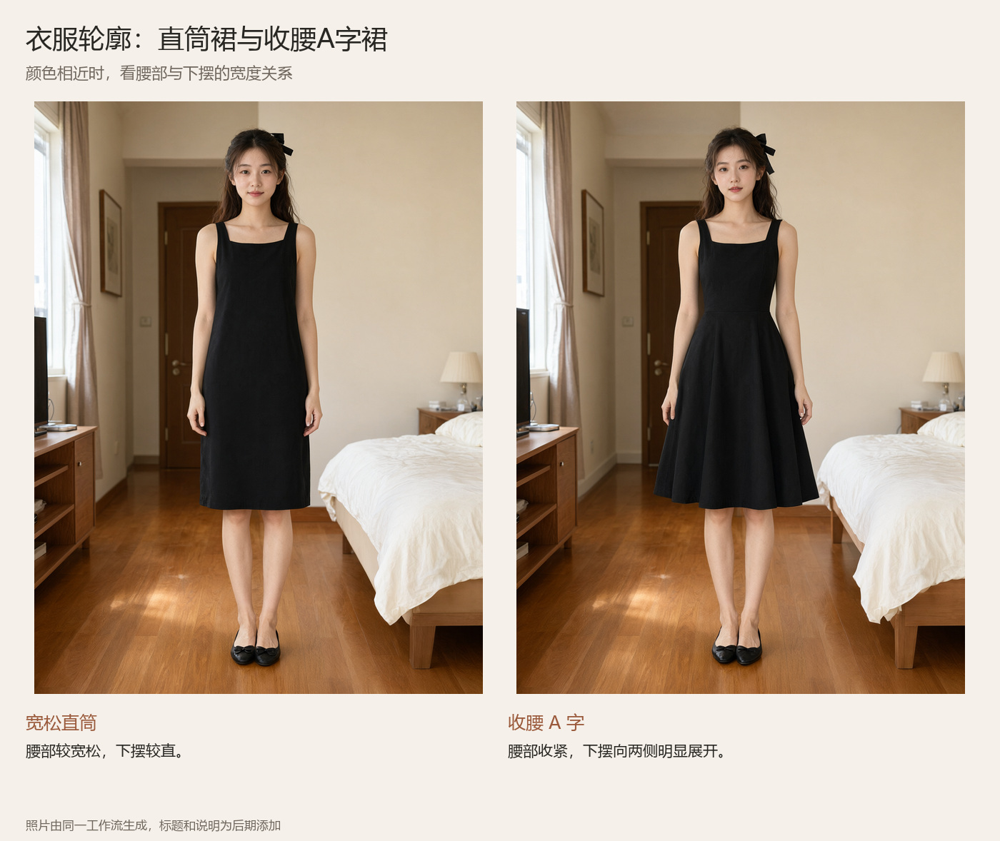

描述衣服，我会先想它的形状。腰部贴身还是宽松？裙摆直直垂下，还是向两侧展开？有没有袖子，肩带有多宽？这些决定了款式，应该比“高级面料”之类的形容写得更具体。

看上面的两条黑裙。直筒款的腰部比较宽松，往下没有明显展开；A字款则在腰部收紧，裙摆向两边张开。它们都可以是黑色、无袖、及膝裙，但穿在身上的轮廓很不同。我会用这些描述解释“直筒”和“A字”，帮助模型区分款式。

```text
黑色无袖及膝A字连衣裙，腰部收紧，裙摆从腰部向两侧展开，下摆宽度约为腰部的两倍。小圆领，宽肩带，布料表面哑光。
```

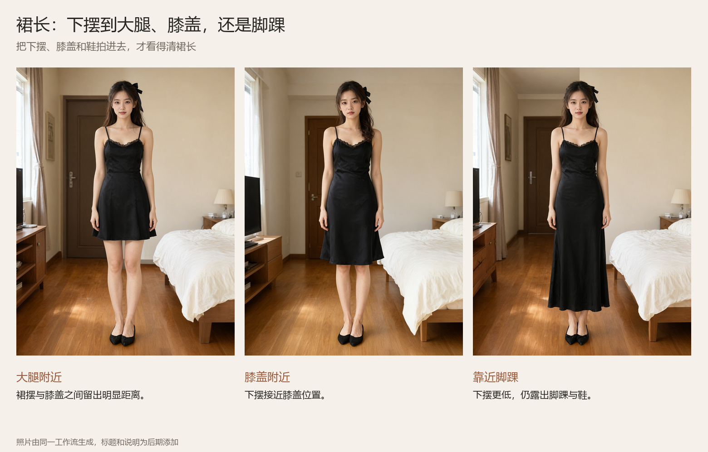

裙长最好写到身体的具体部位。例如大腿中段、膝盖附近、小腿中段或脚踝上方，都比“再短一点”“长一些”容易理解。裙摆要不要盖住鞋，也可以顺带说明。

拍长裙时，我会把脚踝和鞋留在画面里。否则只能看到一大段裙料，很难判断到底有多长。这组图能看出短裙、及膝裙和长裙的区别，但是否精确到提示词要求的位置，还得看图片。

如果是展示某一款衣服，我会认真核对下摆。普通写真对长度没有那么严格，也可以允许上下稍有出入，只要自己清楚这次需要做到什么程度。

### 领口、肩带和袖子要连着描述

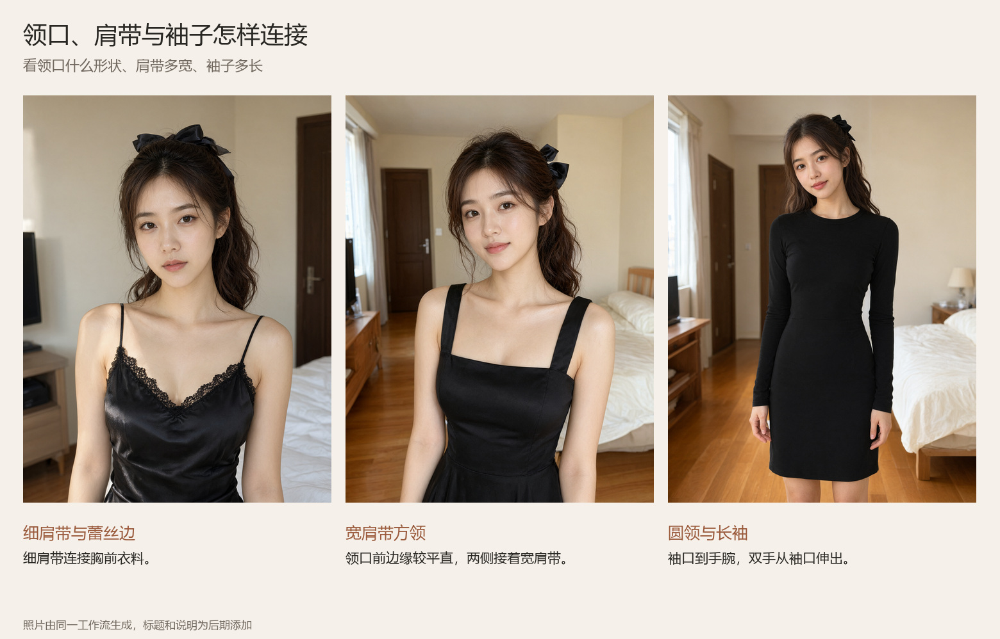

领口决定衣服前面开到哪里，肩带和袖子则决定肩部怎样覆盖。我会连着写，免得只说“换成方领”，结果袖子、肩带甚至整件衣服的款式也跟着变了。

比如方领的前边缘较平直，两条肩带接在左右两角；圆领靠近颈根，长袖从肩头一直到手腕。如果只是领口镶一圈蕾丝，就写清蕾丝的位置，别让模型把整条裙子都画成蕾丝。

```text
黑色宽肩带连衣裙，方领的前边缘平直，两条肩带分别接在领口左右两角。腰部合身，裙身和肩带都是平滑的缎面。
```

看袖长时，要把袖口和手一起看。要求袖子到手腕，图里却只到前臂，就是没有做准。如果手腕被裁掉了，则先扩大取景范围，让袖口露出来，再判断长短。

这次第一张有袖款就只画到了前臂。我改成拍到膝盖以上，保留完整双臂和双手，并写明“袖口到手腕、双手从袖口伸出”，才生成图中的长袖。这次同时改了取景和袖口描述，不能只说是某一个词起了作用。

想只改领口，可以继续保留原来的腰线、裙长和面料。想在吊带裙外加长袖开衫，则要写成内外两件衣服，避免模型把袖子接到裙身上。

### 正面、侧面和背面，各有需要说明的细节

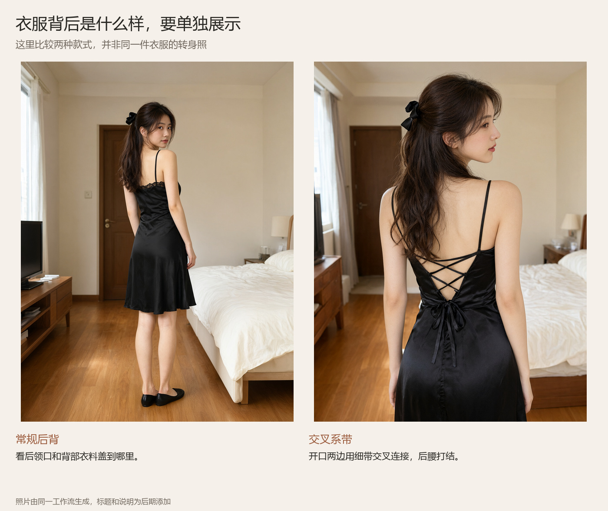

正面能看领口、胸前和腰部；背面可能有开口、拉链或系带；侧面更容易看到接缝、布料交叠和裙摆开衩。只看一张正面照，无法知道衣服背后是什么样。

我写系带后背时，会说明开口从哪里到哪里，两边怎样用带子连起来，最后在哪里打结。光写“后背有蝴蝶结”，可能只得到一只装饰结，并没有交叉穿过开口的带子。

```text
衣服后背从肩胛骨下方开到腰部，开口两侧用黑色细带交叉连接，形成连续的X形。细带在后腰打成蝴蝶结，腰部以下的裙料自然垂下。
```

头发也会挡住后背设计。这张图能看到系带，但还有部分头发留在背上。要展示得更清楚，可以让头发拨到肩前，露出带子相互交叉和打结的位置。

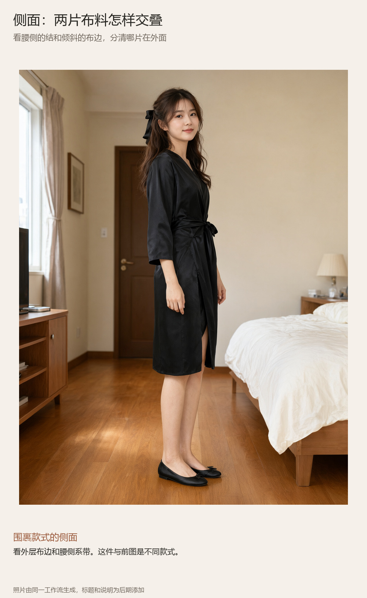

看侧面的围裹款式，我会顺着布料边缘看：哪一片在外，哪一片在内，腰带系在哪里。裙摆的开口也要说清，是两片布料交叠后留下的缝隙，还是另外做的侧开衩。

这里用不同款式讲解不同细节，并不是同一条裙子的连续转身照。如果想做同款衣服的正、侧、背三张图，我会先把三个方向的设计都写清楚，再分别生成，并比较领口、腰线、接缝和裙摆是否相同。

### 叠穿时，写清哪件在外、内层露出多少

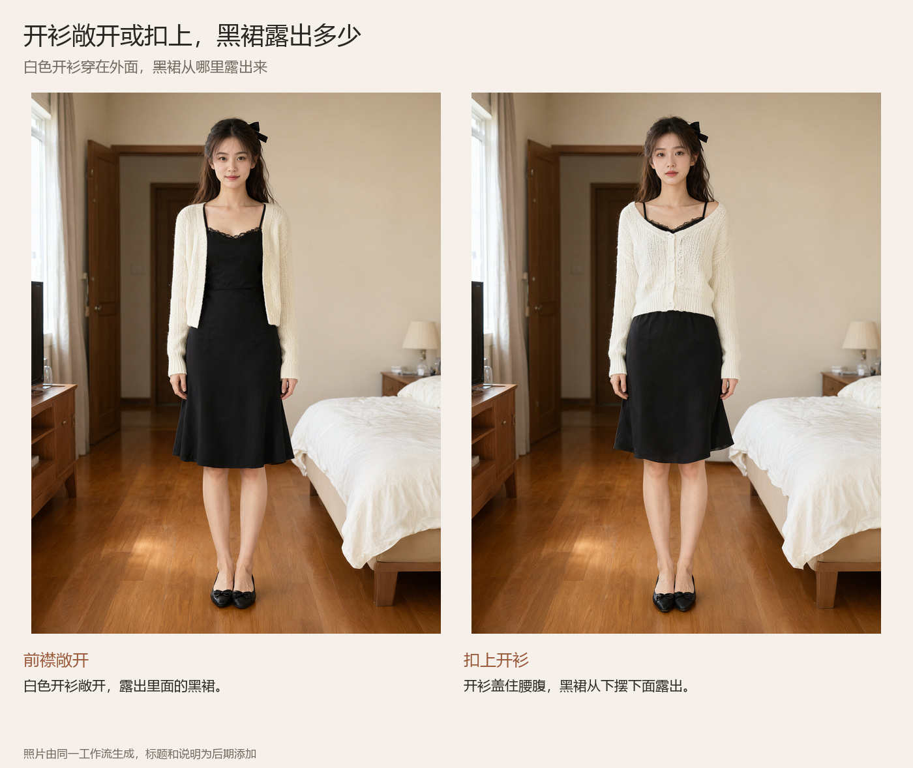

两件衣服叠着穿，要把内外顺序写清楚。这组是白色开衫在外，黑裙在内。开衫敞开时，黑裙的领口、前胸和腰部都能看到；扣上以后，黑裙主要从领口和开衫下摆处露出。

外套有多长也很重要。短到腰部，下面的黑裙大部分还露着；如果外套长过膝盖，可能连裙摆都遮住。想展示内层衣服，就得先决定外层盖到哪里。

```text
黑色连衣裙外穿一件奶油白短款针织开衫，开衫下摆到腰部，袖口到手腕。前襟敞开，左右两片垂在身体两侧，露出黑裙的领口、前胸和腰线，下方裙摆完整可见。
```

看图时，我会先找白色开衫的下摆，再找下面露出的黑裙。颜色不同，比较容易分辨，但还要看衣服是否真的叠在一起。两件衣服如果连成了奇怪的一整片，或者下摆互相穿过，就需要把“谁在外面、谁被盖住”写得更明确。

### 坐下或迈步后，布料也要跟着动作变化

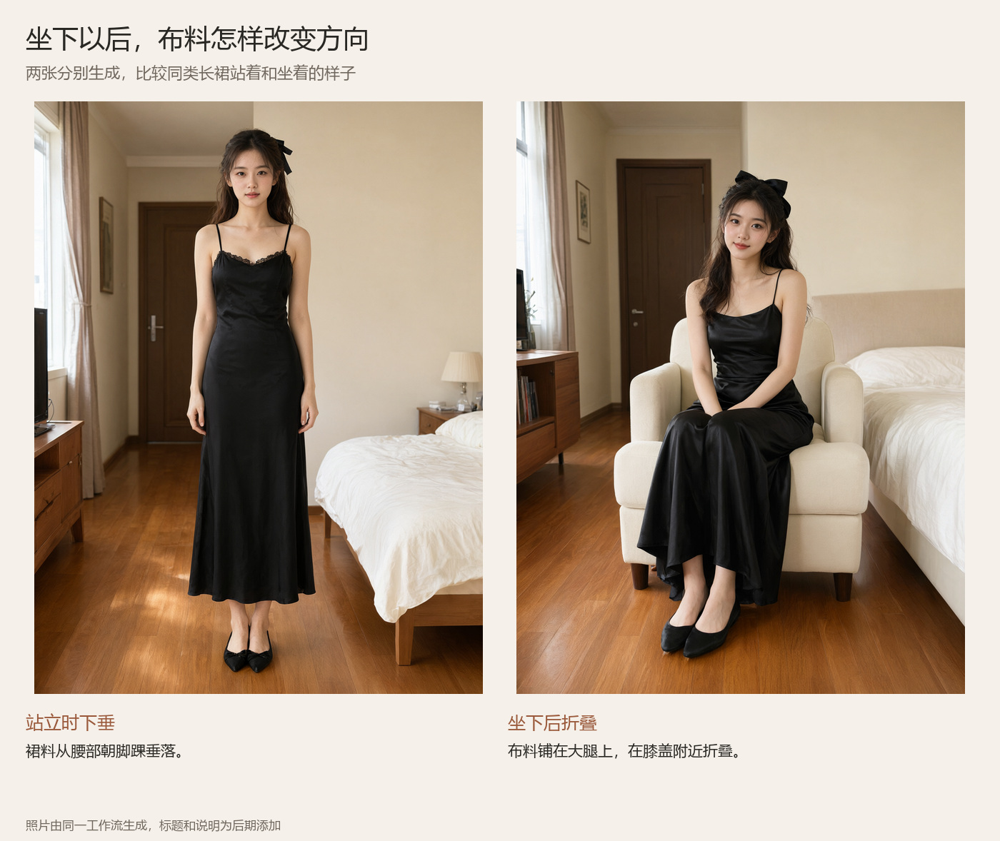

长裙站着时主要向下垂，坐下后会铺在大腿上，在膝弯和椅面附近折叠，再继续向下落。所以，换成坐姿时，也要改写裙料的样子，不能还要求它像站立时那样笔直垂下。

我会先描述布料贴着哪里、搭在哪里，再写褶皱。比如盖住膝盖、铺在椅面上、被手掌轻轻压住，都比单独一句“褶皱自然”更具体。迈步幅度较大时，还要留意裙摆是否莫名变长，开衩有没有跑到另一侧。

```text
人物坐在椅子前沿，双膝并拢弯曲。长裙铺在大腿上，盖住膝盖，在膝弯附近形成褶皱，再从膝盖下方向脚踝垂落。双手轻放在膝上的裙料上。
```

这两张图是分别生成的，用来比较同类长裙站着和坐着的样子。如果要展示同一条裙子连续换动作，就需要更仔细地保留款式，并结合参考图或图片编辑功能逐张比较，不能只凭颜色相同就认定它们是同款。

### 再选面料，写出它在光线下的样子

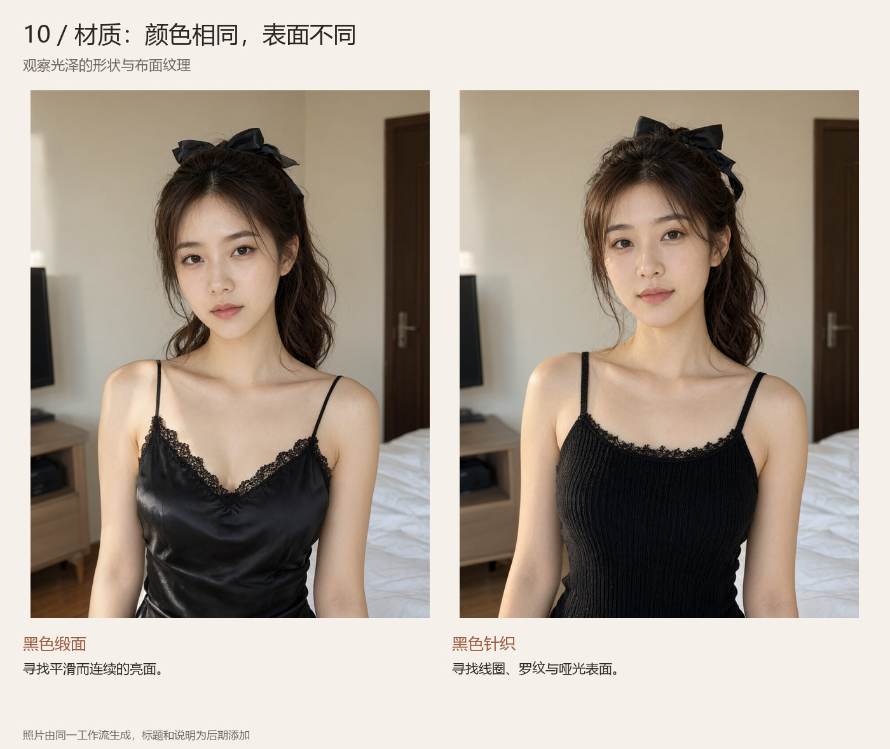

衣服款式想清楚后，我再写面料。缎面可以描述为表面平滑，反光顺着布料延伸；针织可以写清罗纹或线圈；棉布则可以强调表面较哑光。除了面料名称，补上看得见的特点，往往更容易得到想要的质感。

```text
黑色细肩带针织连衣裙，款式和裙长与原先相同。布面有清楚的纵向罗纹，表面哑光，褶皱处的明暗变化柔和。
```

比较面料时，光线最好接近。如果一张是直射阳光下的缎面，另一张是暗房里的针织，颜色和亮度也差很多，就不容易只看出面料的区别。黑色衣服也要留有明暗，才能看清褶皱、缝线和边缘。

想换衣服时，你可以按这个顺序想一遍：款式和长度是什么，领口和袖子怎么做，前后有什么设计，是否搭了外套，动作会怎样牵动布料，最后再选面料。这样不容易只改了颜色，却漏掉真正想换的款式。

## 11｜光线：从哪边照，阴影多重，颜色偏冷还是偏暖

### 先选光照的方向，再看脸有多亮

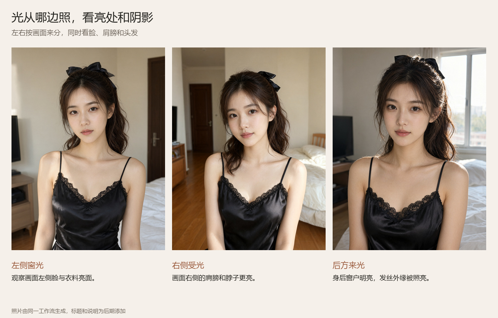

光从哪边照来，会影响脸、脖子和衣服哪边更亮。我会一起看额头、鼻梁、脸颊和衣料，不能只凭某一小块反光判断。背景里的窗户、灯和阴影，也应该与人物身上的光大致吻合。

比较左侧光和右侧光，主要看明亮的部位有没有换边。从背后照来的逆光则会照亮头发边缘，脸可能比较暗。如果还想看清五官，就补一句正面有柔和的光，让脸不至于黑成一片。

```text
窗户在人物右后方，日光照亮头发边缘和右肩。人物正面也有柔和的光，能看清眼睛和五官，但脸颊比明亮的发丝边缘暗一些。身后的窗户较亮。
```

有时一张图里会出现几处方向不一致的阴影。我会回头检查，是不是同时写了太多光源。窗光和灯光可以一起用，但最好说明哪一处最亮，另一处只是稍微照亮暗部，避免每边都像有一盏强灯。

### 再看阴影边缘，以及白天和夜晚的明暗

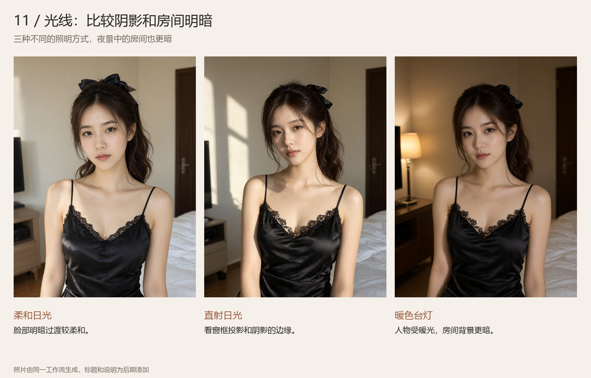

判断光线软硬，可以看阴影的边缘。柔光下，亮处到暗处的变化比较缓；直射阳光下，窗框投影可能很清楚，明暗差别也明显。光线柔和并不代表暗，直射光也不一定照亮整个房间。

颜色冷暖则是另一个问题。柔光可以偏冷，夕阳也可以又暖又有清楚的阴影。如果只写“温柔的气氛”，这些选择就留给模型了。我会把方向、阴影和颜色分别说清楚。

```text
阳光从画面左侧窗户直接照入，墙上留下边缘清楚的窗框投影。人物朝光的一面明亮，背光的一面较暗，黑色缎面上能看见明显的反光。
```

夜晚的台灯图同时改变了照明方式、颜色和房间亮度，可以把它当作另一种拍法来比较。我会看灯旁边、人物脸部和远处床铺是否有明暗差别，别让整个房间亮得像白天。

想让颜色暖一些，还要分别看看皮肤、白床单、黑裙和木地板。暖光下，它们可以都稍微偏黄，但仍应分得出原本的颜色。全图一味染橙，并不能代替合理的灯光效果。

## 12｜焦点和背景：让想展示的东西更清楚

### 背景要多清楚，取决于这张图想看什么

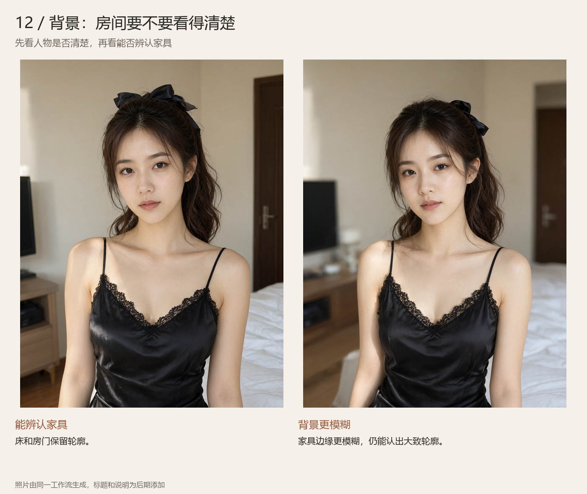

想展示卧室布局，就把家具拍得清楚些；想突出眼神，可以让背景模糊一点。我会根据照片的用途来选，不会把背景越模糊当成越好看。

这组图里，两张都还能认出床、电视柜和门，右图只是边缘更模糊。我原先要求背景虚化得更明显，实际没有完全做到。看图时要按结果说，不能因为提示词写了“模糊成色块”，就认定图片已经如此。

```text
双眼、发丝和靠近镜头的衣料清晰，背景稍微模糊。床、电视柜和远处房门仍能辨认，让人看得出人物身处卧室。
```

我还会检查人物本身是否清楚。背景模糊了，脸却也一起糊掉，就没有达到突出表情的目的。眼睛、鼻子和头发哪里清楚、哪里柔和，也要看起来自然，避免出现突兀的模糊边缘。

### 也可以让近处的花清楚，让远处的人模糊

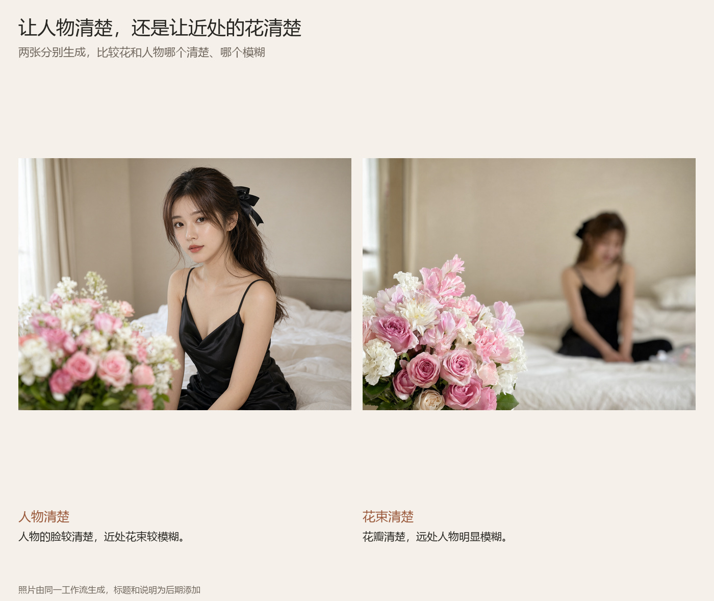

要讲清焦点怎么选，我会安排两个距离不同的对象：花束靠近镜头，人物坐在远一些的床边。再明确要求哪个清楚、哪个模糊，比单独写“浅景深”更容易理解。浅景深就是只有前后较窄的一段距离清楚，离它更近或更远的地方容易模糊。

对焦人物时，重点是她的眼睛和脸，近处花束可以模糊；对焦花束时，重点变成花瓣和花蕊，远处人物只留下大致轮廓。读者首先注意到的东西，也会随之改变。

```text
粉白花束在画面左下方，离镜头很近，人物坐在更远处的床边。花瓣和花蕊清晰，远处人物的五官明显模糊，但仍看得出她坐着的姿势。
```

图片生成后，要同时看花和人。有些图会把两者都画得很清楚，有些只是把后面的墙模糊了，都没有做到这次想要的效果。

第一版对焦花束的图里，人物仍然太清楚。我把照片改写成“花束静物摄影”，强调花很近、人在几米外，同时删去五官细节的描述，才得到右图中明显模糊的人物。

两张图的花束大小、人物位置和衣服也有变化，所以这里比较的是两种拍法，并非同一张照片只换了焦点。它们也不是连续画面，不能用来说明视频里的移焦过程。

## 13｜把前面的选择写成完整提示词

### 我先写一张便于逐项检查的全身照

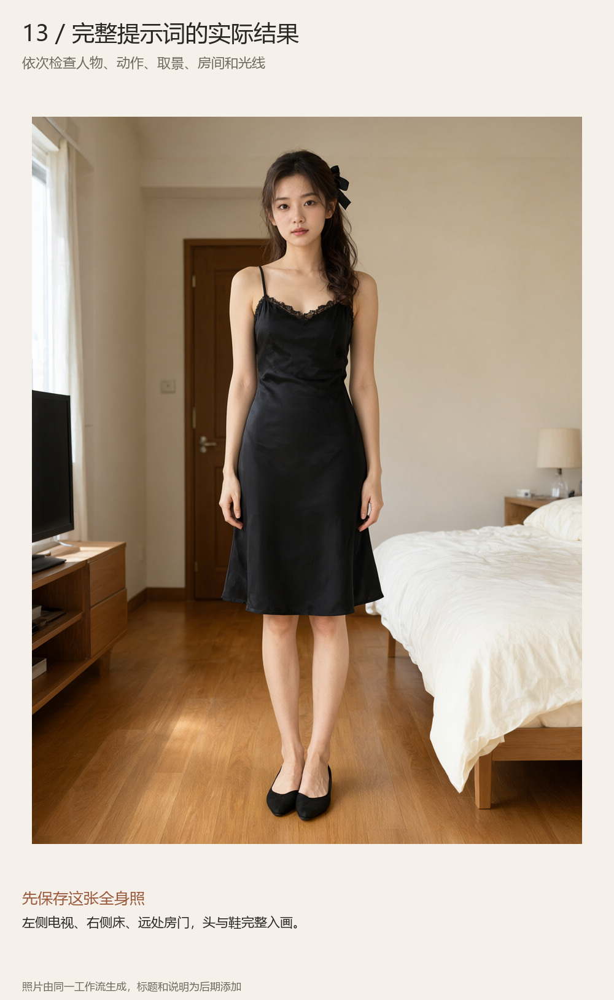

前面讲了很多写法，用的时候需要有所选择。全身穿搭、脸部近照、后背设计，往往各要一张图。我会先确定这次主要展示什么，再安排人物、动作、房间和光线。

这一张用来展示卧室里的全身穿搭。鞋子、裙长和两侧家具都要看见，所以拍全身，背景也保持清楚。站姿先写得简单一些，方便检查衣服和房间。下面保留了当时实际使用的完整提示词，便于对照图片。

```text
竖幅全身人像，从头顶到鞋底完整入画，脚下有一小段木地板，头顶留少量空间。人物位于画面正中央，占画面高度约八成。相机位于人物胸部高度，朝向基本水平，人物上下比例自然。
家中卧室内部，浅米色墙壁，蜂蜜棕木地板，画面右侧是一张铺奶油白床品的床，左侧是低矮木质电视柜和黑色电视，房间远端中央是一扇关闭的深棕色室内门。人物站在床与电视柜之间的木地板过道上，地板线条伸向远处房门。
一位25岁的东亚成年女性，鹅蛋脸，深棕色眼睛，栗棕色长发微卷，半扎发以一只黑色缎带蝴蝶结固定，脸颊两侧留少量碎发。自然淡妆，柔和粉色唇，真实皮肤纹理。
穿黑色细肩带缎面及膝连衣裙，领口有细窄花卉蕾丝，腰部合身，裙摆轻微散开，布料呈柔和流动高光，穿简洁黑色平底鞋。
人物正面朝向镜头，直立站姿，肩膀放松，双脚并列略微分开，双臂自然垂在身体两侧，双手完整可见。目光直视镜头，神态平静，嘴唇轻闭。
柔和日光从画面左侧窗户照进房间，脸部左侧明亮，右侧留有轻微阴影。肤色自然暖亮，黑裙保持深黑层次，白床品保持乳白色，木地板色泽温暖。
写实生活人像摄影，人物五官、头发和衣料细节清楚，家具背景保留清楚可辨的轮廓。
```

我会先看人物是否从头到鞋完整入画，再看床、电视和门的位置，最后看衣服和光线。图中双脚比提示词要求的更靠近，没有准确做到“略微分开”，但全身穿搭和卧室布局都能看清。

你可以按自己的用途改这段。做头像，就不必要求电视柜完整出现；展示后背，就重点写后背设计；想拍背景模糊的近照，也不用把所有家具都详细交代一遍。

### 想加一件开衫，我会怎样改原来的描述

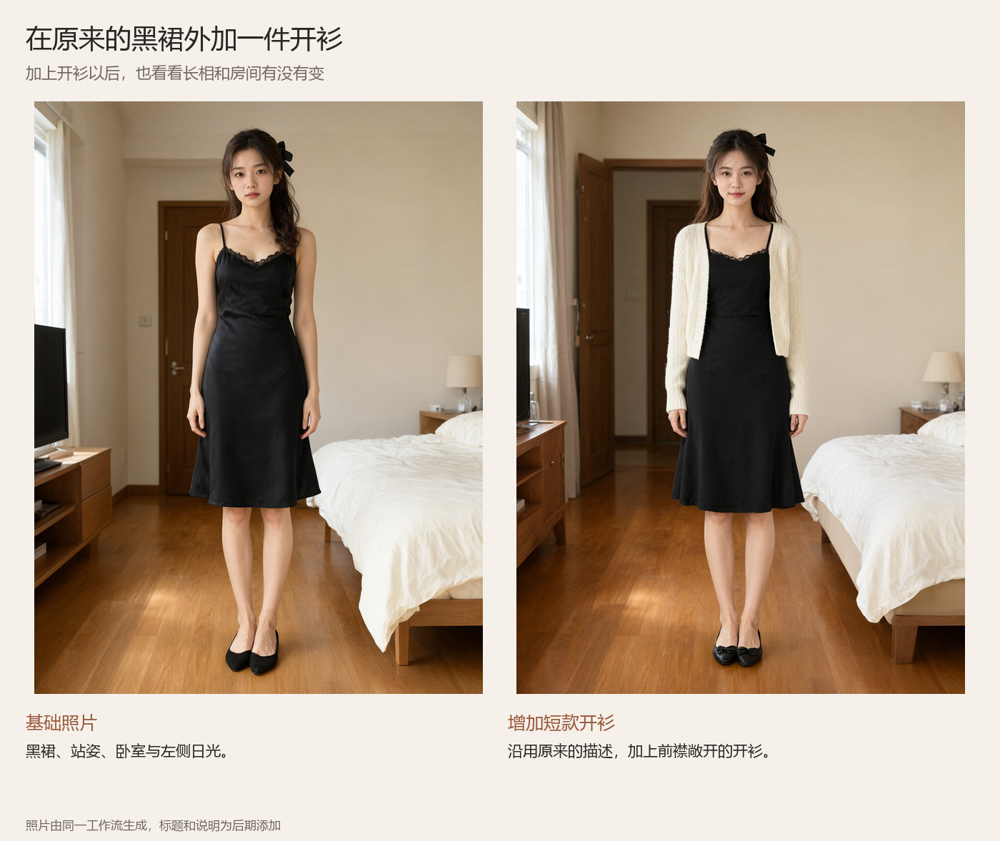

假设这次只想在黑裙外加开衫，我会沿用人物、房间、站姿和光线的描述，主要修改服装那一段。开衫穿在外面，前襟敞开还是扣上，下摆到哪里，都写明白。

这里说的“只改服装”，是指我修改提示词的重点。根据文字重新生成一张图时，脸、家具和裙子褶皱也可能变化，所以原本要保留的地方仍然需要检查。下面同样是实际用过的全文。

```text
竖幅全身照，头顶到鞋底完整入画，人物占画面高度约八成，居中站立，正面朝向镜头，双臂放松下垂，相机在胸部高度水平拍摄。一位25岁的东亚成年女性，鹅蛋脸、深棕色眼睛、栗棕色微卷长发，黑色缎带蝴蝶结固定半扎发，脸侧少量碎发，自然淡妆，柔和粉色唇，真实皮肤纹理。家中卧室，连续蜂蜜棕色木地板，右侧奶油白床铺，左侧木质电视柜，远处深棕色室内房门，米色墙面。黑色细肩带缎面及膝连衣裙，细窄蕾丝领口，腰部合身，裙摆轻微散开，黑色平底鞋。外穿奶油白色短款粗针织开衫，长袖至手腕，开衫前襟敞开，左右前片自然垂在身体两侧，内层黑色裙子的领口、腰线和整段裙摆可见。外层衣摆停在腰部。左侧窗户透入柔和日光，面部与布料细节清楚，背景家具轮廓可辨，写实摄影。
```

不必先准备很复杂的模板。把人物、服装、动作、房间和光线分段写，就比较容易找到要改的地方。也可以请 AI 帮忙整理，自己再通读一遍，删掉重复或互相矛盾的句子。

如果要换的东西很多，我会重新写一份完整画面描述；如果只修一个小地方，又想保住原图的大部分细节，可以选支持图片编辑的工具。本篇使用的是根据文字生成图片的流程，没有演示局部编辑。

## 14｜图片不合要求时，我怎样修改

### 先说清哪里不对，再找提示词里的矛盾

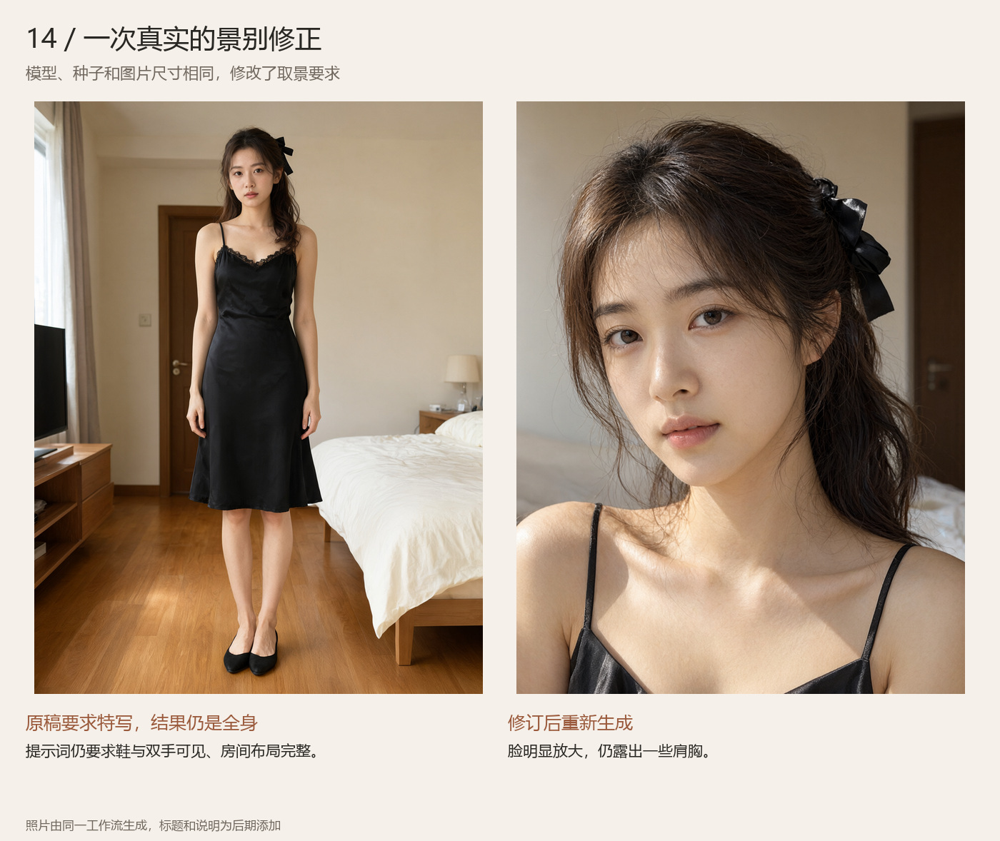

上图就是我遇到过的情况。左图的提示词一开始写了面部特写，后面却又要求露出黑色鞋子和完整双手，还详细描述了整间卧室，最后生成了全身照。我保留人物描述，改成主要拍脸、颈部和肩膀，删去鞋子、完整双手和整间房都要出现的要求。使用相同模型、种子和图片尺寸重新生成后，得到了右图。脸明显放大了，不过仍比原先要求的锁骨位置多露出一些肩胸。

我会先对着图片说清问题，例如照片下边缘到了哪里、鞋有没有出现、房间占了多大面积。再回头查提示词，看看要求近照的同时，是否又写了必须露出鞋或完整手臂。

```text
请比较我想要的照片与当前图片，说明取景范围、人物大小和露出的身体部位有哪些不同。检查提示词是否同时要求展示鞋、双手或完整房间。保留人物和光线描述，修改取景要求，并删掉与之矛盾的内容。最后给我完整提示词，说明改了哪些地方。
```

原提示词、修改稿、种子和生成图片都值得保存，方便下次比较。改过以后效果更接近要求，说明这次修改有帮助；但同时改了几句话，就不能断定只有其中某一个词起了作用。如果想弄清单个词的影响，还需要一次只改那一处再比较。

### 想改的地方对了，其他地方也要再看一遍

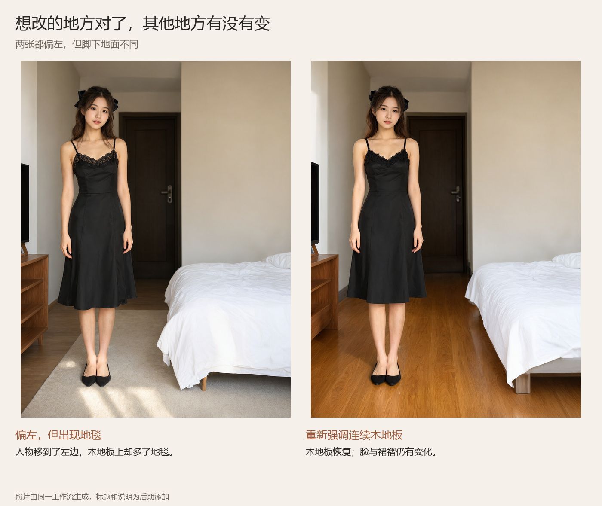

这组图的问题是，人已经移到左边，原来的地板却多了一块地毯。所以我不会只看本次修改的位置，还会看衣服、脸和房间有没有出现不想要的变化。

我重新强调连续木地板，再生成了右图。地毯没有了，但脸和裙子褶皱仍有细微变化。这是重新生成后更接近要求的结果，并不是在原图上只擦掉了地毯。

我会按问题分别处理。少了某件家具，就检查有没有写到；家具位置错了，就把左右、前后说清；两句要求相互矛盾，就删改其中一句。反复生成仍不准确，可以检查图片尺寸是否合适，或考虑参考图、图片编辑等工具提供的其他方式。

还有一种情况，是需要检查的地方根本看不见。袖口被裁掉，不能判断袖长；手指被杯子挡住，不能直接说少了手指；头发盖住后背，也无法看清系带。先让这些地方露出来，再判断是否合要求。

每次重新生成之前，我都会想清楚准备改哪里、下一张该看哪里。这样比不断加上“更自然”“更精致”更容易找到有效的写法。

## 15｜怎样把一张照片扩成一组四宫格

### 先写四格相同的部分，再分别安排动作

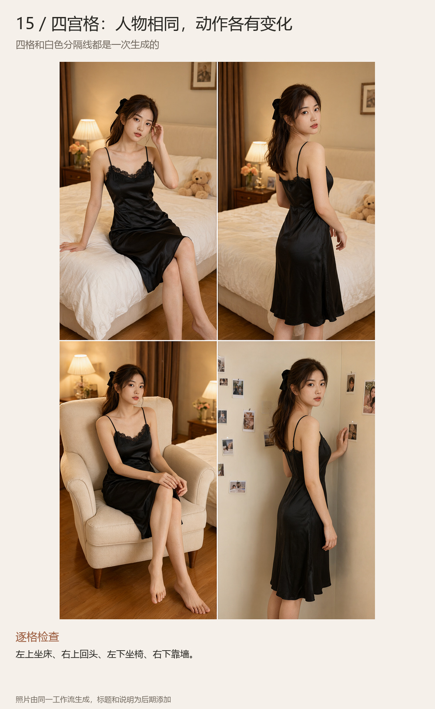

做四宫格，我会先写两列两行、四格大小相同、格子之间有分隔线。接着说明四格都用相同的人物形象、衣服、房间和光线，让它们看起来属于同一组照片。

再给每格安排一个动作。这里是左上坐床、右上背身回头、左下坐椅子、右下靠墙。每一格都分别交代手放在哪里、身体朝哪边、照片拍到哪里，避免只是换动作，却连衣服和房间都换了。

```text
一张竖向9:16的写实人像四宫格拼图，2列2行，四格等大，中间细白线分隔。
四格属于同一位25岁东亚成年女性在同一间暖色卧室拍摄的一组写真。她有鹅蛋脸、深棕色眼睛、栗棕色微卷长发，黑色缎带蝴蝶结固定半扎发，脸侧少量碎发，自然淡妆。四格均穿同一件黑色细肩带缎面及膝连衣裙，领口细窄花卉蕾丝，腰部合身，裙摆轻微散开。
卧室里有奶油白床铺、奶油色布艺扶手椅、蜂蜜棕木地板、浅米色墙面、深棕色窗帘、木质床头柜、暖光台灯、鲜花和一只浅棕色泰迪熊。四格都在这间房内，暖色灯光一致。
左上格：坐在床沿，正面朝向镜头，一手撑在床面，另一手轻触耳旁头发，双膝朝画面右侧，取景从头顶到小腿。
右上格：站在床边，背部四分之三朝向镜头，头向右肩转回看镜头，双臂自然下垂，取景从头顶到膝下。
左下格：坐在奶油色扶手椅内，双腿交叠，双手轻放在上方膝盖，肩膀放松，取景完整容纳头部、椅子和双脚。
右下格：侧身站在贴有小照片的墙边，后肩轻靠墙面，头转向镜头，一只手轻扶墙，另一只手自然下垂，取景从头顶到小腿。
四格面容、发型、衣服和房间布景一致，坐床、背身回头、坐椅、靠墙四种姿势清楚区分。真实肤质、清楚缎面质感，家具背景可辨，照片自然细腻。
```

这张图排成了两行两列，格子之间有细白线。四格的发型、黑色发带、裙装和暖色房间比较接近，坐床、背身回头、坐椅子、靠墙的姿势也都能认出来。不过，右上格只拍到大腿附近，没有按要求拍到膝盖以下；左下格的双手也没完全叠在一起。我会先保留这组图，再针对这些没做准的地方继续修改。

检查衣服时，我会比较领口、肩带、下摆和后背。有一格出现系带，另一格却变成拉链，即使都是黑裙，看起来也不是同一款。需要四格穿同一件衣服，就把这些细节写进所有格子共用的描述里，再逐格比较。

### 只比较表情时，让每格的取景尽量接近

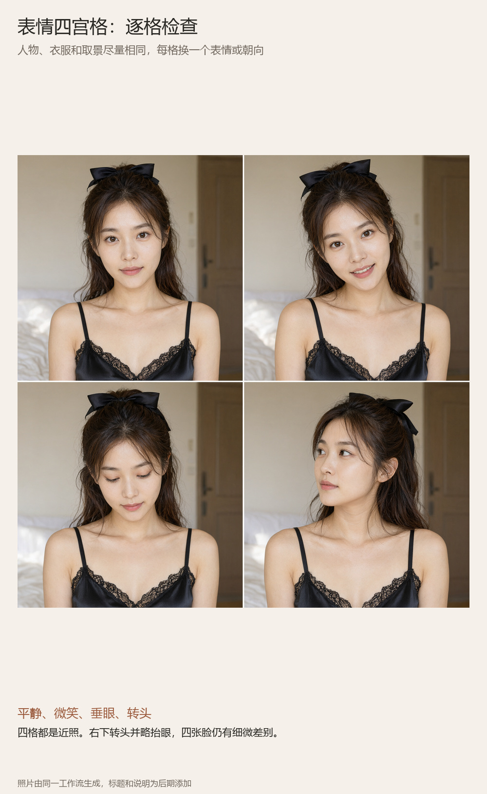

第二组主要比较表情和头部方向，不需要每格都拍整套穿搭。我会让四张脸的大小接近，衣服、背景和光线也尽量相同。这样才容易看出表情的变化，不会一格远、一格近，看起来像四张不相关的照片。

```text
一张2列2行的四宫格近距离人像，四格等大，细白线分隔，每格从头顶到胸口下方，脸的大小接近。一位25岁的东亚成年女性，鹅蛋脸、深棕色眼睛、栗棕色微卷长发，黑色缎带蝴蝶结固定半扎发，脸侧少量碎发，自然淡妆，柔和粉色唇，真实皮肤纹理。四格都是同一位成年女性，相同半扎发与黑色发带、相同黑色细肩带缎面衣料和蕾丝领口，背景都是米色卧室墙面与模糊棕色房门，左侧柔和日光一致。左上：头部正面，目光看镜头，嘴唇轻闭，平静表情。右上：头部正面，目光看镜头，脸颊抬起，嘴角上扬露少量牙齿，自然微笑。左下：头部正面，双眼垂下看衣领，嘴唇轻闭。右下：头向画面左侧转约四分之一圈，眼睛看向画外左侧，表情放松。四格脸型、发型与服装一致，表情或朝向各自有清楚区别。写实摄影。
```

我会先数格子和人物，再看各格取景是否相近，接着比较长相、发型和衣服，最后看表情有没有按要求变化。比如要求垂眼的那一格仍在看镜头，就把它记下来，别因为整张好看便略过。

这次左上平静、右上微笑、左下垂眼，右下向画面左侧转头并略微抬眼，四格之间有明显区别。不过鼻形、脸部轮廓和发带位置仍有细小变化，不能说四张脸完全相同。

生成时使用相同的种子，也就是控制随机起点的数值，便于比较不同提示词，但不能保证人物始终长得一样。这次没有上传人物参考图。如果要求更严格，可以选支持人物参考的工具，或在已有图片上分别修改表情，再拼成四宫格。

如果模型总是分错格子，也可以先生成四张单图，再用排版工具拼接。这样能把行列和大小排准，但四张图里的人物、衣服和房间是否一致，仍然要自己比较。

## 16｜我建议怎样练习

### 第一轮，每次只选一个主要改动

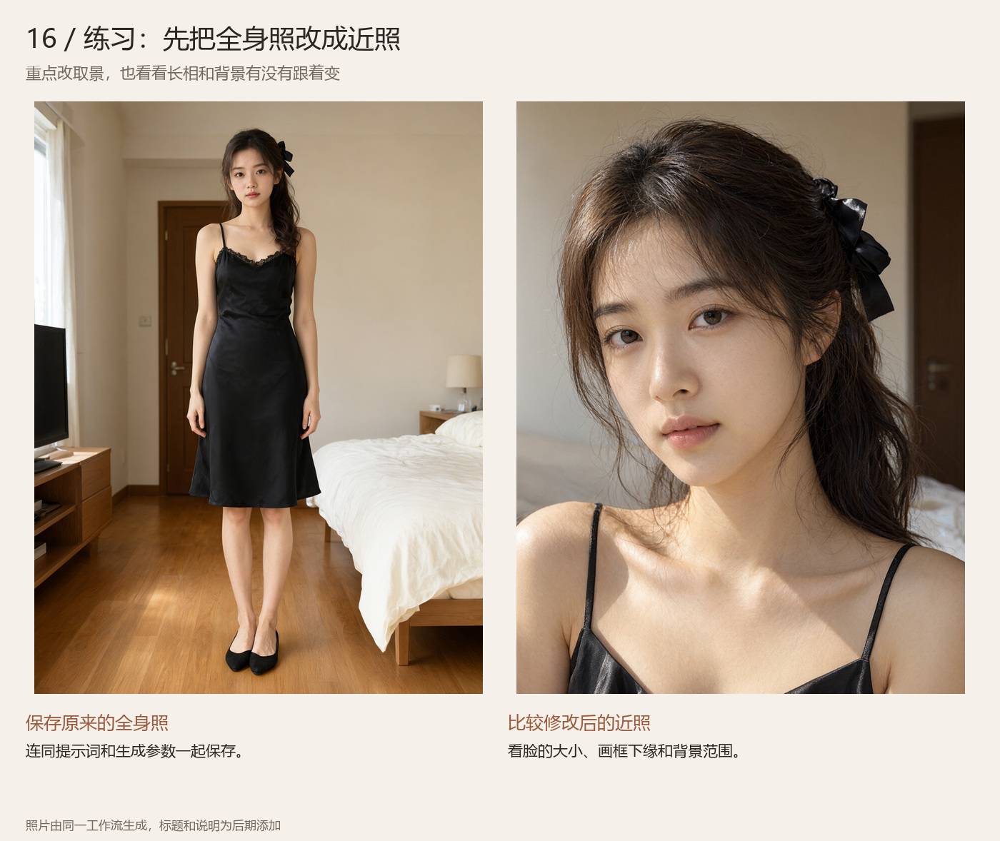

可以先练景别，因为全身变近照的差别很明显。保存一张全身照和完整提示词，改成近照时，顺便删掉必须展示鞋、完整手脚的要求，先沿用原来的人物和光线描述。

图片出来后，先别急着选哪张更漂亮。比较照片拍到了身体哪里、脸有多大、还剩多少背景，再看长相有没有变。把想改的地方和另外发生的变化各写一句，下一次就知道从哪里继续。

下一轮可以换手部动作，再下一轮试着加件外套。每次都先想清楚要改什么、要保留什么，再对着成图检查。慢慢就能分辨哪些话写得具体，哪些地方容易被模型理解成另一种样子。

```text
这次我想把全身照改成近照。请保留人物、服装颜色和光线描述，修改取景范围，删去近照中拍不到的鞋和完整手脚等要求。给出修改后的完整提示词，并提醒我检查脸部大小、背景范围和人物长相是否发生了变化。
```

这段是发给文字助手的修改要求。等它写出完整提示词后，我会再读一遍，再放进生图工具里使用。

### 第二轮，对着图片补全没说清楚的地方

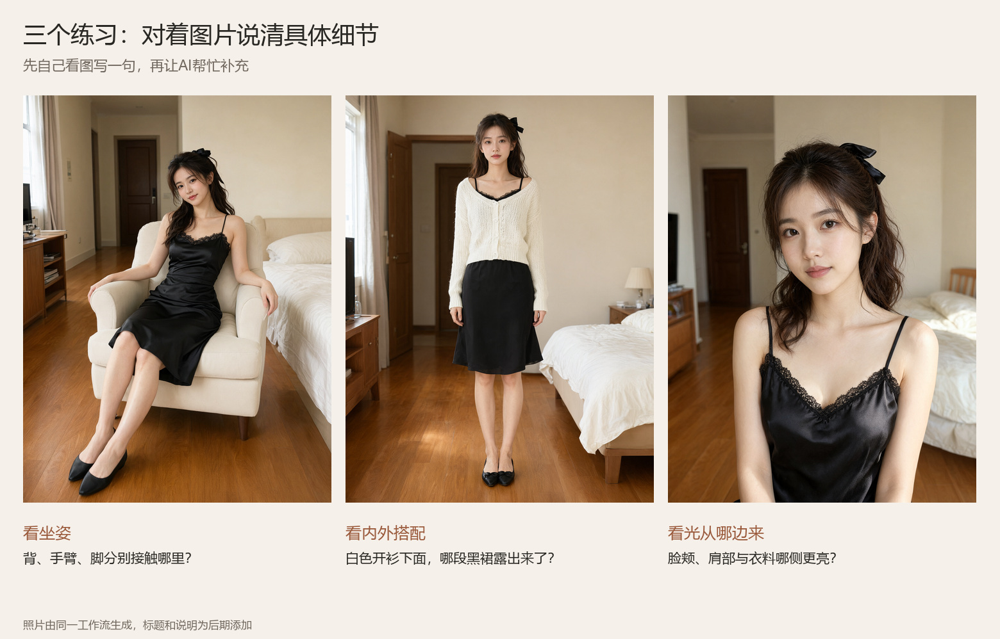

看这三张图，可以分别试着回答一个问题。坐姿图里，后背、手臂和脚各放在哪里？开衫图里，外套盖住了黑裙的哪一段？光线图里，脸和肩膀哪边更亮？

先用自己的话写一句，再让 AI 帮忙补充。写坐姿时忘了椅背，就补上有没有往后靠；写衣服时只说黑白两色，就补上哪件穿在外面；写灯光时只说温暖，就继续描述光从哪里来、哪里有阴影。

答案都要能在图片上找到。例如白色开衫盖住腰腹，黑裙从开衫下摆下面露出；靠坐的人前臂搭在扶手上，后背有没有贴住椅背还得仔细看；判断光线方向，则要把脸颊、鼻子和衣服反光一起比较。

最后，选一张满意的照片，尝试做一组四宫格。先让四格只换表情，再练习不同姿势。保留每次的提示词和图片，如果长相或衣服越来越不一致，就先回到单图，把这些共同的部分写清楚，再继续做整组。

练到这里，我希望你能看着一张图，说清自己原本想要什么、实际生成了什么，以及下一次准备怎样改。以后换人物、换衣服、换房间，都可以照这个方法继续尝试。

---

配图使用本地 ComfyUI 的 Qwen-Image-2.1 工作流生成，模型文件为 `qwen_image_2.1_int8_convrot.safetensors`，参数为40步、CFG 1、Euler、simple。人物均设定为成年女性。素材包和工作目录保留了完整提示词、种子、图片尺寸及生成记录。图上的标题、说明和对比排版是后期添加的，原始照片未据此修改。

第13章和第15章的四段完整提示词按当时使用的原文保留，方便核对配图。其余短提示词用于说明各节写法，可以按自己的需要改写。

